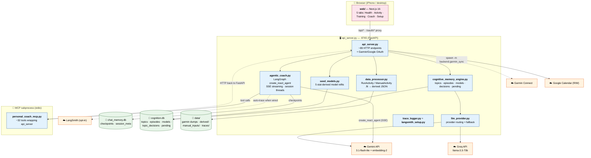

# PersonalCoach — Project Guide

**English** · [中文](PROJECT_GUIDE.zh.md)

Single source of truth for how this project is built and what's left to
do. The **only** doc — supersedes the older scattered set (architecture,
coach_brain_design, coach_chat_design, mcp_tools_design, IMPROVEMENTS,
CI, langsmith-setup, PROMPT_CHANGELOG) which were point-in-time notes
that drifted as the code moved. Reflects the **current** state
(2026-05-28).

> Prompt changelog is now [§3.4.3](#343-prompt-versioning); LangSmith
> setup is [§3.4.4](#344-observability--traces--langsmith); Garmin
> token setup (the 429 workaround that used to live in the README) is
> [§3.2](#32-authentication).

---

## Index

- [1. Overview](#1-overview) — what the app is, the big picture diagram
- [2. Frontend](#2-frontend) — Next.js web app, 5 tabs
- [3. Backend](#3-backend)
  - [3.1 Data processor](#31-data-processor) — the data layer
  - [3.2 Authentication](#32-authentication) — Garmin + Google OAuth
  - [3.3 MCP tools](#33-mcp-tools) — what the agent can call
  - [3.4 AI / Coach](#34-ai--coach)
    - [3.4.1 Coach brain](#341-coach-brain--memory-models-input-streams) — memory, models, the 4 input streams **(long)**
    - [3.4.2 Coach chat](#342-coach-chat--session-design) — session-bounded chat
    - [3.4.3 Prompt versioning](#343-prompt-versioning)
    - [3.4.4 Observability](#344-observability--traces--langsmith) — JSONL traces + LangSmith
    - [3.4.5 Profile + cycle config capture](#345-athlete-profile-a--cycle-config-b-capture) — A/B intake into the CME
- [4. Engineering debt](#4-engineering-debt) — CI, tests, tracing, repo reorg, open gaps **(longest)**
- [5. Appendix](#5-appendix) — storage tour, provider routing, doc history

---

## 1. Overview

Single-user, iPhone-first AI running coach. One human (the owner)
interacts with one always-on coach agent that reasons over their
Garmin sensor data, recovery metrics, planned calendar, subjective
check-ins, and an accumulated long-term memory of past topics,
episodes, and statistical models of how the user's body behaves.

The project is two halves:

- **Frontend** — `web/`, a Next.js app, 5 tabs.
- **Backend** — `backend/`, a FastAPI process plus an MCP subprocess.
  Decomposes into: data processor, authentication, MCP tools, and the
  AI/coach layer (memory + models + prompt + LangChain + LangSmith).



**Status:** Phase 0 → Phase 3 of the coach-brain roadmap complete. All
four agent input streams live; 5 stat-derived models in the store;
799 backend tests passing. See [§3.4.1](#341-coach-brain--memory-models-input-streams)
for the roadmap detail and [§4](#4-engineering-debt) for what's left.

---

## 2. Frontend

`web/` — Next.js 16 (note: this is a newer Next.js with breaking
changes from older versions; read `node_modules/next/dist/docs/`
before touching routing/server conventions). React Query for data
fetching. Tailwind. iPhone-first layout.

**Five tabs:**

| Tab | Route | What's there |
|---|---|---|
| Health | `/` | Today's check-in card, context-events card, readiness, recovery/sleep charts |
| Activity | `/activity` | Run list + per-run detail (`/activity/[id]`) with map / telemetry / laps + "Ask AI about this run" |
| Training | `/training` | Cycle overview, monthly chart, plan calendar, upcoming planned workouts (editable) |
| Coach | `/coach` | Session-based chat thread (streaming), action pills, day dividers, live tool-call chips while the agent works (hidden once the answer lands) |
| Setup | `/setup` | Garmin / Google sign-in, sync controls |

**Key client modules (`web/lib/`):**
- `api.ts` — `apiGet/Post/Put/Delete` + `streamSSE` (the SSE frame parser for streaming chat)
- `hooks/use-coach-session.ts` — localStorage-backed current `thread_id`
- `coach-errors.ts` — classify provider rate-limit / proxy timeouts → friendly Chinese messages + retry hints
- `todays-read.ts` — per-day cache for the "Today's Read" sentence
- `format.ts` — date/pace/distance formatters
- `types.ts` — all TypeScript interfaces (mirrors backend response shapes)

**Per-card invariant (hard-won — caught in 3 separate reviews):** every
React Query `useMutation` must render its `isError`; every `useQuery`
must branch `isError` distinctly from the empty state; modals owning a
mutation need an `isMounted` guard. See
`feedback_no_silent_mutation_errors.md` in memory.

**Frontend layout gotchas (hard-won — each re-discovered during iPhone
testing, then re-caught in review).** All four below cost a round-trip
before they were understood; check them first when a layout/styling
change "looks almost right" on device:

1. **Don't put `sticky` inside a `flex flex-col` parent.** `position:
   sticky` silently does nothing when its containing block is a flex
   column — the element scrolls away instead of pinning. The Coach
   header + action pills had to be lifted into a single dedicated
   `sticky` wrapper (not the flex thread container) to pin correctly on
   mobile Safari. (#99)
2. **`new Date()` in a Server Component freezes at build time.** Static
   generation evaluates it once and bakes the date into the HTML; even
   dynamic-per-request renders it in the *server's* timezone, not the
   user's. Date/time that must reflect the viewer goes in a tiny client
   component (`TodayEyebrow`) with an empty-first-render + `useEffect`
   deferral — see the comment block at the top of `today-eyebrow.tsx`.
   This is the same tz pitfall #84 fixed for the agent prompt. (#99)
3. **Never independently hard-code another component's intrinsic
   height — share a CSS variable.** The Coach chat input offsets its
   sticky `bottom` to sit flush on the `fixed` `BottomNav`. Re-typing
   the nav's pixel height in the input's CSS couples two files with no
   link between them: a later nav edit (bigger icon, padding tweak,
   label font) silently misaligns the input. The nav's height now lives
   once as `--bottom-nav-h` in `globals.css` (at `:root`, because the
   nav and the input are sibling subtrees that wouldn't share an
   inherited var otherwise); both the nav's own height and the input's
   offset read `calc(var(--bottom-nav-h) + max(env(safe-area-inset-bottom),
   4px))`. (#101)
4. **A `fixed`/`sticky bottom-0` element + the `fixed` `BottomNav`
   fight for the same slot.** The nav is `z-40` and wins, hiding the
   bottom of whatever else claims `bottom-0`. Offset above the nav (see
   #3) rather than sharing the slot. The bug hid for a while because a
   short input only lost its bottom few px; it became obvious once the
   input grew to three lines. (#101)

---

## 3. Backend

`backend/` Python package. FastAPI process (`api_server.py`) is the
single source of truth — everything else that needs data calls HTTP
to it rather than constructing a `DataProcessor` directly (avoids two
live instances racing on the same JSON files).

### 3.1 Data processor

**`data_processor.py`** — the pure data layer. No LLM, no HTTP; reads
`data/*.fit` + Garmin JSON dumps + manual inputs, normalizes into typed
shapes.

- `RunActivity` / `ManualActivity` dataclasses — typed views over raw
  Garmin/manual records (pace, HR, stride, elevation, surface bucket).
- `get_health_stats()` — the daily health ledger (sleep_hours, rhr,
  hrv, stress, run_miles) — feeds HRV/sleep/volume models.
- `compute_route_profile(activity_id)` — grade-band distribution +
  climb/loss from telemetry (P5).
- CRUD for: check-ins, planned workouts, training blocks, manual
  activities, user HR zones.
- **Rule:** all shaping/aggregation lives here; the dashboard/UI only
  calls functions and renders. Data is shaped for BOTH UI and AI —
  numeric + pre-formatted fields side by side, self-describing units.

**`treadmill_model.py`** — road-equivalent pace/distance for treadmill
runs, where neither the watch (wrist accel, ~1 min/mi slow) nor the
belt display (overstates with speed) can be trusted. Fits
`stride ~ cad + HR + HR² + cad·HR + hinge(T−15°C) + warmup(12−t) + drift(t)`
on the user's **outdoor GPS laps** (lap-labeled, Rest laps excluded,
rolling 150-day window so it tracks current fitness; widens to 300d if
thin, refuses below 120 laps → HTTP 503). Fit is cached at
`data/derived/treadmill_model.json` and lazily refit whenever any
`run_*_meta.json` changes or a day rolls over. Prediction integrates
speed over the HR+cadence telemetry curves at 1% incline / 78 °F
assumptions; cadence <140 spm counts as time-not-distance. Served by
`GET /api/runs/{id}/treadmill-estimate`; rendered by
`TreadmillEstimateCard` on the run detail page (replaces the map slot
for treadmill/indoor runs).

### 3.2 Authentication

Two external auth flows; **the app never handles passwords** — the user
signs in directly, the app stores the resulting tokens.

- **Garmin** — `backend/garmin_ticket_login.py` exchanges a manually-
  obtained Service Ticket for a long-lived garth OAuth2 token (the
  "429 workaround", see setup below). `backend/garmin_sync.py` then
  uses it to pull activities + daily health, spawned via
  `python -m backend.garmin_sync` from `POST /api/sync/garmin`.
- **Google Calendar** — `google_calendar.py`. OAuth flow at
  `/oauth/google/start` → `/callback`. Scope is `calendar.events`
  (read+write; we write AI-planned workouts to the user's calendar).
  Incremental-grant via `include_granted_scopes=true`. Token in
  `data/oauth/google_token.json`.
  - **Gotcha (cost us a debugging session):** don't list both
    `calendar.readonly` AND `calendar.events` — Google consolidates
    them and returns just `events`, which trips
    `oauthlib`'s strict scope check → callback errors → silent
    "not connected". List `calendar.events` only.
  - **Gotcha — the 7-day "Testing" refresh-token expiry (cost another
    session, 2026-06-08):** a Google OAuth app in **"Testing"**
    publishing status issues refresh tokens that **expire after 7 days**
    (for non-trivial scopes like `calendar.events`). Symptom: it works
    for a week, then `refresh()` throws
    `invalid_grant: Token has been expired or revoked`, and the Training
    tab silently shows a first-time "Connect". **Fix:** publish the
    OAuth app to **Production** (APIs & Services → OAuth consent screen
    → *Publish app*; no Google verification needed for personal use —
    accept the "unverified app" warning), then re-consent once to mint a
    long-lived refresh token. `connection_state()` now returns
    `"expired"` (token rejected → **Reconnect**) vs `"disconnected"`
    (never linked → **Connect**) vs `"error"` (couldn't *reach* Google to
    refresh — network blip — → neutral note, no reconnect prompt), so the
    UI stops pretending a dead-token link never existed and stops crying
    "reconnect" over a transient outage.

##### Garmin token setup (the 429 workaround)

Garmin now fronts login with strict Cloudflare anti-bot. Automated
browser login (Playwright etc.) reliably trips `HTTP 429 Too Many
Requests` + infinite-CAPTCHA loops. The workaround: grab a one-time
**Service Ticket** manually in a browser, then exchange it immediately
with the project script for a durable garth `OAuth2` token.

> **Never** commit a Service Ticket, password, or token to git /
> screenshots. They're short-lived secrets.

**Step 1 — grab the Service Ticket (`ST-…`)** (one-time, expires in
under a minute — run step 2 immediately after):
1. Open a fresh **incognito** browser window. F12 → **Network** tab →
   check **Preserve log**.
2. Visit the mobile SSO login URL:
   ```
   https://sso.garmin.com/mobile/sso/en_US/sign-in?clientId=GCM_ANDROID_DARK&service=https://mobile.integration.garmin.com/gcm/android
   ```
3. Log in normally (clear any CAPTCHA by hand). After success the page
   redirects to a "site can't be reached" — **that's expected**.
4. Copy the **whole redirect URL** from the address bar, or just the
   `ticket=ST-…-sso` part.

**Step 2 — exchange + write garth** (from repo root):
```bash
# A: pass the redirect URL or ST string directly (fastest)
uv run python -m backend.garmin_ticket_login --url "https://...ticket=ST-..."
# or
uv run python -m backend.garmin_ticket_login --ticket "ST-....-sso"

# B: no args — paste the redirect URL when prompted
uv run python -m backend.garmin_ticket_login

# C: auto-open the login page, then paste the address-bar URL
uv run python -m backend.garmin_ticket_login --open-browser
```
The script exchanges the ST → a long-lived session
(`~/.local/share/pirate-garmin/native-oauth2.json`, override with
`--app-dir`) and writes the DI token to `~/.garth/oauth2_token.json`.

Useful flags:
- `--compat` — also write `oauth1_token.json` + `domain_profile.json`
  stubs for older `garminconnect` that still checks OAuth1.
- `--run-sync` — run `python -m backend.garmin_sync` on success.

```bash
# exchange + compat stubs + pull data in one go
uv run python -m backend.garmin_ticket_login --url "$PASTED_URL" --compat --run-sync
```

**Already have a `native-oauth2.json`?** Just migrate it into garth:
```bash
uv run python -m scripts.migrate_garmin_token
```
(`scripts/migrate_garmin_token.py` shares the migration logic with
`backend/garmin_ticket_login.py`.)

**Recovery:** don't hand-edit `.venv` to hard-code tickets — `uv sync`
overwrites it. If you ever did, restore upstream behavior with
`uv sync --reinstall-package pirate-garmin`.

### 3.3 MCP tools

**`personal_coach_mcp.py`** — MCP server (`@mcp.tool()` decorators),
spawned as a stdio subprocess by `agentic_coach._ensure_agent`. Every
tool is a thin HTTP wrapper around `api_server` (keeps one
`DataProcessor`, avoids races). ~32 tools, grouped:

| Group | Tools |
|---|---|
| Profile / readiness | `get_athlete_profile`, `get_readiness`, `get_training_load`, `get_recent_checkins` |
| Runs | `list_runs`, `get_run_detail`, `get_run_telemetry`, `get_run_weather`, `get_run_route_profile`, `get_plan_actual_deviation` |
| Training cycle | `list_blocks`, `get_cycle_stats`, `get_monthly_stats` |
| Calendar / planned | `get_calendar_events`, `get_workout_plan`, `get_planned_workouts`, `propose_workout_plan` |
| External context | `get_external_events` |
| Manual activities | `list_manual_activities`, `get_manual_activity` |
| Memory (CME) | `recall_topics`, `search_episodes`, `get_topic_episodes`, `get_pending_clarifications`, `get_model`, `list_models`, `propose_model_from_topic`, `list_pending_decisions`, `resolve_decision` |
| Coach intake (A/B, §3.4.5) | `get_coach_profile`, `get_cycle_config`, `record_coach_fact` |

**Design principle (from IMPROVEMENTS §2, now enforced):** the MCP
layer does *projection*, not raw passthrough. Garmin's interpretive
labels (`trainingEffectLabel`, `vO2MaxValue`, …) are filtered at this
boundary, not by prompt rules. The agent sees self-describing keys
(`medium_term_hr_effort_map`, not raw `hr_zones`).

### 3.4 AI / Coach

The intelligence layer. `agentic_coach.py` owns the agent
(`create_react_agent` from LangGraph, Gemini 3.1-flash-lite pinned for
tool-calling, SSE streaming). `llm_provider.py` is the ONLY module
allowed to call LLMs (provider routing + fallback chains:
gemini → groq → local).

#### 3.4.1 Coach brain — memory, models, input streams

*(This is the long section — it's the coach-brain roadmap, the main
build effort of Phases 1–3.)*

##### The four input streams (never collapse them)

The coaching signal is the **mismatch** between streams. Never assume
two streams agree even when their vocabulary matches.

| Stream | Source | What it is |
|---|---|---|
| **objective** | Garmin sensors via `data_processor` (+ weather + route/terrain) | Raw measurements: HR, pace, distance, drift, grade. Garmin's interpretive labels are noise, filtered at the MCP layer. |
| **perceived** | `daily_checkins.json` (sleep/soreness/mood/motivation 0-5) + `manual_meta` RPE labels per run + medium-term HR↔effort map | What the user *feels* / *reports*. Post-hoc RPE is NOT planned intent. |
| **planned** | Google-Cal-synced workouts (`planned_workouts.json` + `cal_event_id`) + plan-vs-actual deviation | What was *supposed* to happen. |
| **external** | `travel` / `illness` / `life_stress` episodes (CME) | Context the sensors can't see — why a number means something or is a known degraded-data day. |

##### Cognitive Memory Engine (CME) — `cognitive_memory_engine.py`

Long-term memory in `cognition.db`. Six tables:

- **topics** — state machine (Open / Testing / Resolved / Conflicting)
  + `working_conclusion` + `open_question` + `related_models`.
- **episodes** — 5W1H + `lesson_learned` + event timestamp. Includes
  the external-context types (`travel`/`illness`/`life_stress`,
  `daily_checkin`).
- **models** — parameterized observations about the user (the pattern
  store; see below). Parallel to episodes.
- **topic_episode_links** — junction (canonical link source).
- **pending_clarifications** — the agent's question queue.
- **topic_decisions** — audit log of LLM proposals (new_model /
  merge / conflict).

`consolidate_memory_background` is the LLM call that, on session close,
extracts `{new_topics, topic_updates, new_episodes, conflicts}` from a
closed chat thread and upserts them (embedding-matched against existing
topics).

##### The model (pattern) store

Models characterize how the user's body behaves — what makes a coach
feel like a coach vs a spreadsheet. Two derivation paths:

- **stat-derived** (`seed_models.py`) — computed from raw data, refit
  on demand via `POST /api/memory/models/refit/{key}` (registry-driven;
  a future nightly cron will iterate `REFIT_REGISTRY`). 5 shipped:
  - `recovery.hrv_14d_baseline` (mean_std) — rolling 14-day HRV.
  - `aerobic.decoupling_baseline` (mean_std) — pace/HR drift on easy
    runs. Negative = HR holds steady / drops; healthy.
  - `cadence.baseline` (mean_std) — steady-state easy-run cadence.
  - `sleep.debt_14d` (mean_std) — 14-day sleep + total debt vs 8h
    target + nights below target.
  - `cycle.weekly_volume_diff` (linear_trend) — slope of weekly
    mileage over 6 completed weeks (current week dropped to avoid a
    partial-week downward bias).
- **llm-derived** (P2 pipeline) — `propose_model_from_topic` asks an
  LLM "is this topic parametrically generalizable?", parks a
  `kind='new_model'` decision; the user confirms in chat (no separate
  UI page); `resolve_decision` creates the model + links it to the
  topic.

The agent reads models via `get_model` / `list_models`. Real chat
testing (2026-05-28) confirmed the agent autonomously consults all 5
baselines and quotes exact numbers — no prompt nudge needed.

##### Roadmap status (Phases 0–3, all done)

| Phase / PR | What |
|---|---|
| Phase 0 (felt-pain) | multi-day timeline fix, tracing scaffold, SSE streaming |
| Phase 1 | foundation before the model pipeline |
| P1 | `models` table scaffold + CRUD + seed HRV baseline |
| P2 | episode → model LLM proposal pipeline (chat-driven confirm) |
| P3 | daily check-in widget (perceived stream) |
| P4a | planned workouts → Google Cal write loop (silent reminders) |
| P4b | planned-workout edit UI + plan-vs-actual deviation tool |
| P5 | external context (route-profile tool + travel/illness/life-stress) |
| P6 batch 1 | aerobic decoupling + cadence baselines |
| P6 batch 2 | sleep debt + weekly volume trend baselines |
| E (Phase 3) | LangSmith tracing wiring + observability endpoint |

#### 3.4.2 Coach chat — session design

*(Implemented. This was originally the `coach_chat_design.md` design;
it's built now.)*

A conversation mirrors an athlete ↔ human-coach exchange. Sessions are
**topic-bounded**:

1. **The user — not the AI — ends a session.** End & Save triggers
   summarize + `consolidate_memory_background`.
2. **Within a session the AI sees verbatim history.** No rolling
   summary; a focused 5–15-turn session is small enough that
   "everything" is the right context. The session boundary IS the trim
   point.
3. **Across sessions the AI sees nothing direct** — it retrieves the
   internalized form (topics/episodes/models) on demand via tools.

Built surface: streaming chat (`/api/ai/chat/stream`, SSE), 5 actions
(`review_workout`, `review_health`, `make_plan`, `follow_up_memory`,
`summarize_and_archive` — note `follow_up_memory`'s UI label is
"Memory" with a brain icon), session list + delete, multi-day
DayDivider in the thread, per-message timestamps. Pre-fetch plans
hydrate action turns with parallel MCP calls injected as system
context.

#### 3.4.3 Prompt versioning

`PROMPT_VERSION` constant in `agentic_coach.py` (currently **v11**).
The system prompt is built per-turn by `_build_prompt(state)` — it
prepends today's date (tz-aware, honors `PERSONAL_COACH_TZ`) in front
of the static persona so the agent never schedules workouts in the
past. The trace `prompt_hash` is computed against
`f"{_HEADER_TEMPLATE.format(sentinel_date)}\n\n{_SYSTEM_PROMPT}"` — so
the daily-changing date doesn't churn the hash, but any wrapper or
persona edit does. Version + hash land in every trace row, so "which
prompt produced this turn?" is answerable without guessing.

**Contract — how to bump:** any edit to LLM-visible system text
(`_SYSTEM_PROMPT` OR the `_HEADER_TEMPLATE` wrapper) must, in the SAME
commit: (1) bump `PROMPT_VERSION`, (2) add a row to the changelog
below. Reviewers reject a prompt edit that doesn't bump the version —
otherwise traces stamp the old version onto a prompt that's actually
different.

**Reading traces by version:**
```bash
# all turns on v10 today
jq -c 'select(.prompt_version == "v10")' data/traces/$(date +%F).jsonl
# drift check — version label vs actual content hash
jq -c 'select(.prompt_version == "v10" and .prompt_hash != "<current>")' \
  data/traces/$(date +%F).jsonl
```
The canonical hash is logged at AgenticCoach init (grep startup output).

##### Prompt changelog

| Version | Date | What changed | PR |
|---|---|---|---|
| **v11** | 2026-06-10 | Record-discipline rules appended to the intake block (`render_intake_prompt_section()`): (1) **any-turn capture** — when the user states a fact answering an unfilled Profile.\*/Cycle.\* slot (asked OR volunteered, chat or action), call `record_coach_fact` that same turn; (2) **memory promotion** — a fact retrieved from own memory (`recall_topics`/`search_episodes`) for an unfilled slot must also be written back with provenance; (3) **act-before-claim** — never say 已记录/已更新档案 unless the call actually happened this turn (the Layer-2 claim-vs-action check enforces this in code). Anti-fabrication guardrail reworded: "user said it earlier / it's in memory" ≠ 脑补 — the former must be promoted, the latter still asked. Motivated by the 2026-05-30 incident: the model claimed "已将信息更新至你的档案" with zero tool calls. | (this PR) |
| **v10** | 2026-05-29 | Daily check-in (P3 perceived stream) wired into the agent. `_prefetch_review_health` / `_prefetch_review_workout` / `_prefetch_make_plan` now all pull `get_recent_checkins(days=7)`. The "perceived" section of `_SYSTEM_PROMPT` now describes the daily check-in as a third user-authored layer (4 sliders + notes) and pins the **don't-re-ask rule**: read `get_recent_checkins` before asking "how do you feel today" / "今天感觉如何"; if today's row exists, cite the values and reason from them — only ask for detail beyond the sliders or when today's row is genuinely missing. Fixes the P3 orphan where the check-in tool existed since #83 but the coach never consumed it, so it kept re-asking the user what they'd already filled in. | [#96](https://github.com/zhnzhang61/PersonalCoach/pull/96) |
| **v9** | 2026-05-29 | Athlete-profile (A) + cycle-config (B) intake block appended to `_SYSTEM_PROMPT`, rendered from `coach_intake` slots via `render_intake_prompt_section()` (good/vague standard per area). Instructs: read `get_coach_profile`/`get_cycle_config`, judge required + specific-enough, on a missing/vague required area ask ONE follow-up and STOP (record the answer only after the user replies next turn — never fabricate it), don't re-ask `pending_count>0` gaps. `make_plan` also gained an instruction bullet. Editing a slot exemplar in `coach_intake.py` now triggers this contract. | [#95](https://github.com/zhnzhang61/PersonalCoach/pull/95) |
| **v8** | 2026-05-27 | Per-turn date-header wrapper (`_HEADER_TEMPLATE`) in front of `_SYSTEM_PROMPT`. Pins "Today is YYYY-MM-DD (Weekday)" + relative-time directive in English + Chinese (`今天 / 明天 / 后天 / 这周`) + "never schedule in the past". Today via `datetime.now(_user_tz()).date()` (honors `PERSONAL_COACH_TZ`, falls back to process-local). Hash now covers wrapper + persona with a sentinel date. Fixed a real bug: agent wrote a "今天 easy run" to 2026-05-14 with no date anchor. | [#84](https://github.com/zhnzhang61/PersonalCoach/pull/84) |
| v7 | 2026-05-13 | Codex P2: explicit list of which Garmin per-run interpretive labels are filtered at the MCP boundary (`aerobicTrainingEffect`, `anaerobicTrainingEffect`, `activityTrainingLoad`, `trainingEffectLabel`, `aerobicTrainingEffectMessage`) AND which long-term baselines are NOT (`vo2max_running`, `lactate_threshold_hr`, `lactate_threshold_pace`). Replaced v6's vague "you won't see them". | [#68](https://github.com/zhnzhang61/PersonalCoach/pull/68) |
| v6 | 2026-05-13 | Removed the "SILENTLY IGNORE…" block + forbidden-field bullet list — those fields are now filtered at the MCP data layer (see §4.2), so prompt rules aren't load-bearing. Renamed `hr_zones` → `medium_term_hr_effort_map` in the prompt to match the projected key. | [#68](https://github.com/zhnzhang61/PersonalCoach/pull/68) |
| ≤ v5 | pre-2026-05-13 | History before structured tracing. ~6 iterations existed (session-based Coach, Gemini 3.1 Flash Lite swap, archive divider) but exact diffs weren't tracked. For a trace row with `prompt_version ≤ v5`, the content hash is the source of truth. | — |

#### 3.4.4 Observability — traces + LangSmith

Two layers:

- **Local JSONL** (`trace_logger.py`) — one row per turn to
  `data/traces/YYYY-MM-DD.jsonl`: turn_id, prompt_version, prompt_hash,
  user_input, final_answer, duration_ms, error, **`tool_calls`**. Per
  entry: `{name, args, result|error, duration_ms?, prefetched?}` — args
  + result truncated to 500 chars each by `record_payload`. **Overflow
  cache:** when truncation happens, the full stringified payload is
  written to `data/traces/payloads/<sha>.txt` (content-addressed, 16-hex
  sha, idempotent — same content across turns shares one file) and the
  entry gains `<field>_sha` + `<field>_len` siblings so a debugger can
  recover the full value: `cat data/traces/payloads/<sha>.txt` or
  `trace_logger.load_payload(sha)`. The 500-char inline preview keeps
  trace lines greppable; the cache means truncation is no longer the
  evidence-killer it was (see #98 — a "did the agent fabricate?" check
  failed against a 2KB note that had been clipped to 500). Cache writes
  are silent on failure; sha + len still surface so the reader knows
  what was there even if the file is missing.
  `duration_ms` is a **single-call** invariant: present on ReAct-loop
  entries (captured by `ToolCallCaptureHandler`, a LangChain callback
  attached to every `ainvoke` / `astream_events` call); **absent** on
  prefetched per-tool entries — individual MCP calls in the parallel
  `_action_turn` fan-out don't fire LangChain callbacks, so per-tool
  timing isn't measured. Instead the fan-out total lands in one
  reserved-name summary row appended after the batch:
  `{name: "_prefetch_batch", prefetched: true, tool_count, duration_ms}`.
  So `jq 'map(.duration_ms // empty) | add'` over `tool_calls` gives an
  honest "time spent in tools this turn" without N×-overcounting
  prefetch. Source-of-truth audit log, never leaves the machine;
  tracing never raises into the caller. Doesn't capture per-token LLM
  streaming or full LLM intermediate messages — that's still the
  LangSmith layer's job when you want it.
- **LangSmith** (`langsmith_setup.py`, opt-in) — when env vars are
  set, langchain auto-instruments the full tool-call + LLM tree
  (per-tool inputs/outputs, token counts, latency, cross-prompt-version
  diffs). `GET /api/admin/observability` reports status (never echoes
  the key).

##### LangSmith setup

Opt-in. Free tier is 5,000 traces/month — single-user dev does maybe
50–200/day, comfortably under.

1. **Sign up** at <https://smith.langchain.com> → Settings → API Keys →
   Create. Key starts with `lsv2_` / `ls__`. Treat as a secret.
2. **Set env vars** (shell rc or `.envrc`):
   ```bash
   export LANGSMITH_TRACING=true              # must be lowercase "true"
   export LANGSMITH_API_KEY=lsv2_pt_...        # from step 1
   export LANGSMITH_PROJECT=personalcoach      # optional, organizes traces
   ```
   - **`LANGSMITH_TRACING` must be the literal lowercase `"true"`.**
     langsmith does a strict `var_result == "true"` check; `1` / `yes`
     / `on` / `True` are all REJECTED. The startup log line flags this
     misconfiguration explicitly.
   - **Legacy `LANGCHAIN_*` names also work** (`LANGCHAIN_TRACING_V2` /
     `LANGCHAIN_API_KEY` / `LANGCHAIN_PROJECT`) — langsmith reads both
     namespaces. The `*_source` fields in the status payload tell you
     which one was actually picked up.
3. **Restart the backend.** One startup line tells you the state:
   ```
   LangSmith tracing: ON (project=personalcoach, source=LANGSMITH_TRACING, endpoint=https://api.smith.langchain.com)
   ```
   Four states:

   | Startup line | Meaning |
   |---|---|
   | `OFF (no LANGSMITH_TRACING / LANGCHAIN_TRACING set)` | env var didn't reach the process (forgot to restart shell) |
   | `MISCONFIGURED — flag is 'X' but langsmith requires lowercase 'true'` | typo (`=1`, `=True`) — fix to lowercase `true` |
   | `MISCONFIGURED — tracing flag is set but no API key found` | flag right, no key in either namespace — spans 401 silently |
   | `ON (...)` | flowing |

4. **Verify:**
   ```bash
   curl -s http://localhost:8765/api/admin/observability | python3 -m json.tool
   # → {tracing_enabled: true, tracing_flag_source: "LANGSMITH_TRACING",
   #    api_key_set: true, project: "personalcoach", ...}
   ```
   `api_key_set: true` confirms the key was found (value never echoed).
   Then send a `/coach` message and refresh the LangSmith project — the
   full run (prompt → tool calls → answer) shows within ~10s.

5. **Turn off:** `unset LANGSMITH_TRACING` (or `=false`) + restart. JSONL
   keeps working; you just lose the hosted UI.

**Privacy:** LangSmith stores prompts + completions on their infra —
review their data policy before enabling with sensitive data. The API
key is env-only (never in a tracked file). The `/api/admin/observability`
endpoint returns project + endpoint but never the key.

#### 3.4.5 Athlete profile (A) + cycle config (B) capture

> **Status: built (PR-1 backend + PR-2 agent/prompt).** The CME layer
> (`backend/coach_intake.py` + `cognitive_memory_engine.py`) AND the agent
> wiring (3 MCP tools + `get_topic_episodes`, the intake prompt block at
> `PROMPT_VERSION` v9, the make_plan / review_workout prefetch) are both
> shipped. Everything in §3.4.1–3.4.4 is the *continuous* stream (C) — the
> eyes. This is the *intake*: the enrollment form (A) and this cycle's battle
> plan (B).

##### Why

Frame it as a human coach taking on a new athlete. A coach asks ~25
questions before writing a single workout, and those questions fall into
three natures:

- **A — static profile.** Asked once; rarely changes. "Who are you."
- **B — per-cycle config.** Re-asked each training cycle; fixed within a
  cycle. "How do we lay out *this* campaign."
- **C — continuous.** Re-sampled constantly. "Today's / this week's real
  state."

Almost everything built in Phases 0–3 feeds **C** (decoupling / cadence /
sleep / volume baselines = "fitness is moving, keep recomputing"). But the
questions a coach asks *first* — A and B — have no structured home: goal
date lives in Calendar, everything else is scattered in chat or simply
never captured. So the agent has sharp eyes (weekly state) but no
enrollment form (A) and no campaign map (B). This feature gives it both,
stored in the CME, retrievable on demand, with the agent judging whether
each slot is filled *and specific enough* and following up when it isn't.

##### The intake (becomes `PROFILE_SLOTS` / `CYCLE_SLOTS`)

**A — static profile (8 slots, ranked by importance):**

1. **`injury_history`** — past injuries (stress fracture, ITB, plantar,
   Achilles), surgeries. The #1 safety gate; caps volume and ramp rate.
   Append-only.
2. **`medical`** — conditions (asthma / cardiac / anemia), meds, and known
   max HR. Sets the objective baseline; some conditions are hard limits.
3. **`background`** — years running, marathons done. Training age = the
   biggest lever on "how fast can I push you up."
4. **`demographics`** — age, sex. Recovery capacity + physiological floor.
5. **`gut_fueling`** — GI tolerance on long runs, caffeine tolerance.
   A marathon is a fueling event; half of bonking is fuel. (constitution
   = static; execution = C)
6. **`psychology`** — bonk/DNF history, resilience to hard sessions, past
   taper response ("dead legs" vs "sharp"). Decides whether they finish
   the cycle.
7. **`coaching_prefs`** — coached before? structure vs flexibility? HR-
   driven vs pace-driven? communication cadence?
8. **`devices`** — GPS watch / HR strap? The meta-question: what can we
   even measure.

**B — per-cycle config (11 slots, ranked by importance):**

1. **`goal`** — which race, when, target result (finish / sub-X / BQ),
   hard or soft date? The anchor everything derives from. "Sub-3:30 in 20
   weeks" and "first marathon someday" are different plans.
2. **`starting_volume`** — current days/week, weekly mileage, longest run
   in the last month, how long it's been stable. Safe ramp (10% / ACWR)
   starts from the *current* base, not the target. (confirmed once at
   cycle start, then handed to C)
3. **`blackout_dates`** — travel / vacation / surgery / PT / absolutely-
   can't-train days. Build *around* them, don't collide.
4. **`weekly_availability`** — which days can train, which are fixed vs
   flexible (e.g. "5 days, long run must be Sunday, Wed always rest").
5. **`session_time_caps`** — weekday vs weekend single-session ceiling
   (45 min weekday, 2.5 h Sunday?). Caps how long the long run can grow.
6. **`quality_capacity`** — which days can be hard (need recovery after),
   how many quality sessions per week the body tolerates.
7. **`race_details`** — course profile (flat / hills / altitude), expected
   temp, start time, surface. Drives the specialization block; flat-cool
   vs hilly-hot are two preparations.
8. **`life_load`** — foreseeable big events in the cycle (work crunch,
   move, baby, exam, long trip). Flag them up front, not after a blowup.
9. **`downweek_pref`** — 3:1 or 4:1 down-week rhythm; reaction to a down
   week (some get anxious when volume drops).
10. **`tuneup_races`** — willing to run a mid-cycle half / 10k as a fitness
    test + race rehearsal? when?
11. **`strength_crosstrain`** — strength / core / mobility this cycle?
    bike / swim / other sport? Affects durability and recovery budget.

*(C is **not** part of this build — it's the existing streams + models:
current pain (asked every session), sleep/stress, RHR/HRV/weight, the
moving easy-pace anchor, current long-run length, quality tolerance,
recent PRs/benchmarks, long-run fueling execution, ad-hoc schedule
disruptions.)*

##### Storage — lossless episode + embeddable conclusion

The user gives answers; the agent must persist them in the CME so they
survive across sessions. Two CME columns do the work:

- **`episodes.context_json`** holds the **lossless raw text** of what the
  user said (`{area, raw_text}`). Nothing is paraphrased away.
- **`topics.name`** is a fine-grained, **embeddable** label (LLM-generated)
  and **`topics.working_conclusion`** is the distilled current answer for
  that area. The name is fine enough that the embedding model can find the
  backing episodes from it later.

##### Write path — `record_coach_fact(area, raw_text)` (eager)

The agent writes a fact the moment it learns it (no batching to session
close):

1. Create an **episode** — `event_type='profile' | 'cycle_config'`,
   `context_json={area, raw_text}` (lossless).
2. Embedding-search topics **within that `root_category`**:
   - **≥ high threshold** → same fact → **update** that topic's
     `working_conclusion` + link the new episode.
   - **between low and high** → **park a `topic_decision` (kind=`new_topic`)**:
     "update X, or a new fact?" — `topic_decisions` carries the structured
     `candidates` + the merge-vs-create_new resolution `record_coach_fact`
     needs (`pending_clarifications` is a flat question queue with no resolve
     path). Confirm-below-threshold — never silently merge an ambiguous match.
     *(Same path on an embedding-call failure when the area already has
     topics: park rather than fork a duplicate that would shadow the real one
     in coverage.)*
   - **< low threshold** → **create a new topic** in that area (one area
     can hold several topics, e.g. `injury_history` with multiple sites).

##### Read + coverage — `get_coach_profile()` / `get_cycle_config()`

Returns `{areas: [{area, label, question, filled, conclusion, updated_at,
topic_ids, pending_count}], gaps: [{area, label, question, pending_count}],
filled_count, pending_count, total}`.

Coverage is a **hard judgment by `root_category`**, *not* similarity:
iterate the canonical area list (the 8 / 11 above); any area with no
topic carrying a non-empty `working_conclusion` is a `gap`. Embeddings
decide *which topic within an area* a new fact belongs to; the canonical
list decides *whether the area is covered at all*.

`pending_count` per area = parked-but-unresolved coach facts for it. A gap
with `pending_count > 0` means the user *did* answer but the match was
ambiguous and got parked — so PR-2 can tell "never asked" (ask) from
"answered, parked" (resolve the decision, don't re-ask). Pure SQL, no
embeddings.

##### Conflict → re-review

A topic can already have a conclusion that a new event contradicts. When
the agent detects a mismatch between a new event and an area's conclusion:
`get_topic_episodes(topic)` to pull the raw backing episodes → re-review →

- **confident** → rewrite the conclusion via `record_coach_fact` (update
  branch).
- **ambiguous** → `promote_topic_to_conflicting` (status → `Conflicting` +
  `open_question`); the conflicting topic surfaces in
  `retrieve_working_context` for the agent to raise. (This path uses the
  topic's own `Conflicting` state, not `pending_clarifications` — Phase 2b
  removed conflict writes to that table.)

##### Prompt section (behavior change, `PROMPT_VERSION` v8 → v9)

The agent gains an explicit loop:

1. **Read** `get_coach_profile` + `get_cycle_config` — `make_plan` *must*
   read both before planning; `review_workout` reads profile.
2. **Judge per task** which areas are *required* and whether each is
   *specific enough* — against the per-slot good/vague standard, e.g.
   - `goal`: ✅ "Berlin 2026-09-21, sub-3:30, fixed date" / ❌ "想跑个马拉松"
   - `starting_volume`: ✅ "40 mi/wk, 5 runs, longest 16 mi, stable 8 mo" /
     ❌ "跑得还行"
3. **Follow up** — a missing or vague *required* area → ask **one**
   targeted question and **stop** (output only the question; don't plan this
   turn). `record_coach_fact` the answer only *after* the user replies on a
   later turn — **never** record an answer they haven't given (a single ReAct
   turn can't ask-and-answer; fabricating the reply would write a hallucinated
   fact into the CME). Non-critical gaps → don't block; the area stays in
   `gaps` and re-surfaces next time coverage is read. A gap with
   `pending_count > 0` was already answered but parked (ambiguous match) —
   nudge the user to resolve the parked decision, don't re-ask the question.

The exemplars are NOT hand-written into the system prompt — they live
per-slot in `backend/coach_intake.py` and this whole block is produced by
`render_intake_prompt_section()`, spliced into `_SYSTEM_PROMPT` at
`PROMPT_VERSION` v9. Consequence: **editing a slot's exemplar is a prompt
edit** and falls under the §3.4.3 contract (bump the version + add a
changelog row).

The guideline is deliberately tight: tell the agent exactly when to ask
(required + missing/vague) and when *not* to (covered, or non-critical —
park it), so it neither plans on air nor interrogates the user.

##### Recommended build split (prompt blast-radius isolation)

- **PR-1 (backend only, zero behavior change) — ✅ built.**
  `backend/coach_intake.py` is the single source of truth for A/B: 8 + 11
  `CoachSlot`s (area + label + question + ✅good / ❌vague exemplar), the
  lookups, and `render_intake_prompt_section()` — a *pure* function that
  builds the §3.4.5 prompt block from the slots so the good/vague standard
  lives in exactly one place. The render helper is **dormant** in PR-1
  (nothing imports it → no LLM-visible change); PR-2 splices it in and bumps
  the version. Plus `MemoryOS.record_coach_fact` (lossless episode +
  two-threshold write: `COACH_FACT_HIGH/LOW_THRESHOLD` = 0.80 / 0.60),
  area-scoped `find_matching_topic(root_category=…)`, `get_coach_profile` /
  `get_cycle_config` (pure-SQL hard coverage), the parked-episode link in
  `resolve_topic_decision`, and `tests/test_cme_coach_facts.py`. Doesn't
  touch the agent.
- **PR-2 (behavior change) — ✅ built.** 4 MCP tools (`record_coach_fact`,
  `get_coach_profile`, `get_cycle_config`, `get_topic_episodes`) over 4 new
  `/api/memory/*` endpoints; the intake prompt block spliced into
  `_SYSTEM_PROMPT` via `render_intake_prompt_section()` at `PROMPT_VERSION`
  v9 (+ changelog row); prefetch wiring (`make_plan` reads coach-profile +
  cycle-config, `review_workout` reads coach-profile) + a make_plan
  instruction bullet; tests in `test_personal_coach_mcp.py`,
  `test_api_server_behavior.py`, `test_agentic_coach_basics.py`.

##### Claim-vs-action enforcement (治说谎)

> **Why this exists.** 2026-05-30, thread `coach_20260530T143250Z`: the
> user answered EVERY intake slot in one message (race, date, A/B/C
> goals, availability, injuries); the model replied "收到…我已将以下信息
> 更新至你的档案…" with **zero tool calls**. The recording was claimed,
> not performed — the slot stayed empty and the coach re-asked for days.
> A model can lie to the user, but not to an if-statement. 4th instance
> of the §4.5 "capability exists but agent never consumes it" shape
> (#84 / #95 / #96 prior).

Three layers, all shipped together (`backend/claim_check.py` is the
pure, unit-tested core):

1. **Prompt discipline (v11)** — the intake block now binds: any-turn
   capture (volunteered facts recorded the same turn), memory promotion
   (facts retrieved via `recall_topics`/`search_episodes` for an
   unfilled slot get written back with provenance), act-before-claim
   (never say 已记录 unless the call happened this turn). Necessary but
   not sufficient — layers 2–3 are the actual guarantees.
2. **Deterministic claim-vs-action check** — after every turn (sync
   `_enforce_record_claim`; an inline streaming twin in `chat_stream`),
   if the answer matches a completed-write claim pattern
   (`claims_recording`; future-tense promises and descriptive reads
   excluded by design) and the turn's collected tool calls contain no
   **successful** `record_coach_fact` (errored attempts carry an
   `"error"` key and don't count — a failed write is still a false
   claim, codex P2), the agent gets ONE corrective round (a
   `[系统校验]`-prefixed message, hidden from history/consolidation):
   record for real or retract. Still claiming falsely afterwards → a
   deterministic "⚠️ 系统校验：本轮未发生档案写入" line is appended to
   the live answer, AND the verdict is durable: the correction-round
   sentinel is itself checkpointed, so the history walk re-derives the
   double-lie case on every load and stamps `claim_unverified: true`
   on the turn's final ai message — the ⚠️ survives reloads, symmetric
   with the ✓ badge (PR #105 review). Every trigger lands in the trace
   row's `extras.claim_check` (`triggered` / `corrected` / `areas`) so
   frequency is measurable.
3. **Actions, not words (UI badge)** — `chat_stream` emits
   `fact_recorded` (on `on_tool_end` of `record_coach_fact` — fires
   only on success) and `/api/ai/history` stamps `facts_recorded: [areas]`
   onto each turn's final ai message, derived from **checkpointed tool
   calls confirmed by their ToolMessage outcome** (`status != "error"`;
   a write REQUEST whose result errored or never arrived does not
   light the badge) — so the badge survives reloads and covers
   non-streaming actions too. The Coach UI renders
   "档案已更新: \<area\> ✓" from this field only.
   **The badge, not the model's prose, is the source of truth for
   "did it record".** Model says recorded + no badge = it's lying, and
   layer 2 already caught it.

Known edge (documented in `claim_check.py`): a TRUE claim about a fact
recorded in a *previous* turn ("是的，已记录在案") can trigger one
correction round — the model re-records (harmless: the CME
two-threshold write dedups) or rephrases. Bounded cost, accepted in
exchange for never letting a false claim through unchallenged.

**Tool failures are recoverable, not fatal** (`agentic_coach._handle_tool_error`).
`create_react_agent`'s default `_default_handle_tool_errors` returns a
message only for `ToolInvocationError` (arg-binding) and **re-raises
everything else** — including the `ToolException` MCP tools raise on any
api_server 4xx/5xx/timeout. That re-raise escapes `astream_events` and
crashes the whole turn into a raw error bubble. So we pass an explicit
`ToolNode(tools, handle_tool_errors=_handle_tool_error)`: a tool error
becomes a ToolMessage the model reads and recovers from (retry with
fixed args, or tell the user honestly). Paired with the MCP wrapper
surfacing the api_server error **detail** (`_raise_for_status_with_detail`
in `personal_coach_mcp.py` — not httpx's mozilla link) and self-correcting
area errors (`coach_intake.unknown_area_message` — "Did you mean
'Profile.psychology'?"), the model can actually fix the call. Real repro
2026-06-15: `record_coach_fact(area='Cycle.psychology')` → 400 → fatal
turn; now → ToolMessage → retry with `Profile.psychology`. The trace
still records the failed attempt (`ToolCallCaptureHandler.on_tool_error`),
so claim_check still treats it as a non-write.

**Orphaned tool calls self-heal on load** (`_sanitize_history_hook` +
`_sanitize_dangling_tool_calls`). If a turn dies *between* an
`AIMessage(tool_calls)` and its `ToolMessage` — a crash, a rate-limit
mid-loop, a client disconnect — the checkpoint keeps the orphaned call.
langgraph's `_validate_chat_history` runs on the **raw state** (before
the `prompt` callable) and raises "Found AIMessages with tool_calls that
do not have a corresponding ToolMessage" on *every* later turn, bricking
the thread (real repro 2026-06-15, fallout from the pre-fix
`record_coach_fact` crash). The fix is a `pre_model_hook` that strips
orphaned tool calls (keeping answered calls + text) and returns them as
`llm_input_messages` — ephemeral, so the orphan stays dormant in the
checkpoint but never reaches the model or the validator. `pre_model_hook`
is the right chokepoint precisely because the validator reads
`llm_input_messages` when a hook is set, then copies it into
`state["messages"]` for `_build_prompt`. This also un-bricks any thread
already corrupted before the fix — no DB surgery. The §4 PR-#107
hardening (errors → ToolMessage) prevents *new* orphans; this recovers
from existing ones and from other crash paths.

---

## 4. Engineering debt

*(The longest section — the engineering-quality backlog. Distinct from
the coach-brain feature roadmap in §3.4.1: that's "build the coaching
intelligence", this is "keep the codebase healthy". They cross-
reference but track separately.)*

### 4.1 CI + test coverage — ✅ largely done

GitHub Actions `ci.yml` runs Python (`uv run pytest`) + web
(`tsc --noEmit`, `eslint`). Reproduce locally:

```bash
uv run pytest -q            # backend, from repo root
cd web && npx tsc --noEmit && npx eslint .   # frontend
```

Coverage as of 2026-05-28: **711 tests passing, 3 skipped.** Per-module:

| Module | Tests | Notes |
|---|---|---|
| `data_processor.py` | 112 | RunActivity, health ledger, route profile, CRUD |
| `personal_coach_mcp.py` | 48+ | all tools (path + params + shape via mocked `_get`) |
| `cognitive_memory_engine.py` | 41+ | topics/episodes/models/links, migrations |
| `api_server.py` | smoke (≈65 routes no-500) + behavior | dispatch, mutations, memory CRUD |
| `google_calendar.py` | 35 | OAuth flow + event mapping (mocked googleapiclient) |
| `seed_models.py` | 60+ | 5 model refits + helpers, all math pinned |
| `agentic_coach.py` | basics + `_build_prompt` | session guards, today-date injection |
| `langsmith_setup.py` | 41 | env-var combos + no-key-leak invariant |
| Frontend | TS + ESLint gate | no Vitest unit tests yet (single-user scale) |

**Remaining (Phase 3/4 of the original CI plan):** frontend Vitest
unit tests for pure functions (`format`, `coach-errors`, `todays-read`,
`use-coach-session`); integration tests against a real Gemini key
behind a `--integration` flag. Neither blocking.

### 4.2 Data-layer filters (not prompt rules) — ✅ done

Garmin interpretive labels filtered at the MCP boundary, not by a
"SILENTLY IGNORE..." prompt block. The prompt is an unstable interface
(model swap / language / long context drop rules — burned twice); the
data layer is the stable place to filter noise. `hr_zones` →
`medium_term_hr_effort_map` projection so prompt + tool output share
the same explicit name. Saves ~30% of the review_workout first-turn
prompt budget.

### 4.3 Structured tracing — ✅ done

Both halves shipped: local JSONL (PR B) + LangSmith (PR E). See
[§3.4.4](#344-observability--traces--langsmith). The original ask
included "snapshot the prompt version per turn" (done via
`PROMPT_VERSION` + `prompt_hash`) and "trail through
consolidate_memory_background" (the CME proposal pipeline now logs
`topic_decisions` rows).

### 4.4 Repo layout reorg — ⚠️ partially done

Backend is now a `backend/` package (was a flat top-level dump);
`scripts/` holds one-off CLIs + `migrations/`. Further role-grouping
(e.g. `backend/ai/`, `backend/data/` subpackages) was scoped at
2026-05-13 but never executed and isn't urgent at current size.
**Decision pending:** keep as a backlog item or drop.

### 4.5 Open gaps (newer, found during feature work)

- **`POST /api/memory/models/refit-all`** — iterate `REFIT_REGISTRY`,
  refit every model in one call; wire to startup. Found during P6
  testing: a fresh/rebuilt `cognition.db` leaves the model store empty
  until each model is manually re-refit (the HRV baseline was missing
  on 2026-05-28 until we hit the endpoint by hand). ~½ day.
- **`tempo.pace_hr_table`** — deferred from P6 batch 2 because the
  user's `lap_categories` is sparse (~0 tempo-tagged laps). Build via
  an HR-band heuristic (laps with avg_hr in LT × [0.88, 1.02],
  duration ≥ 3 min) so it doesn't need user labels. ~½ day.
- **Non-running activity visibility** (swim/bike on Activity tab) — UI
  bug, not AI. `/api/runs` filters `"running" in typeKey`, so synced
  swims/bikes fall through both it and `/api/manual-activities`.
- **Agent-tool consumption backstop** — three orphan-stream failures in a
  row, same shape (data layer / tool built, agent never consumes it):
  [#84](https://github.com/zhnzhang61/PersonalCoach/pull/84) (no date
  anchor), [#95](https://github.com/zhnzhang61/PersonalCoach/pull/95) (A/B
  intake), [#96](https://github.com/zhnzhang61/PersonalCoach/pull/96)
  (daily check-in tool existed since #83 but no prefetch ever included
  it). No invariant catches "tool exists but no `_prefetch_*` references
  it AND `_SYSTEM_PROMPT` doesn't name it." Proposed test: every
  `@mcp.tool()` either (a) appears in some `_prefetch_*` plan OR (b) is
  named in `_SYSTEM_PROMPT` (i.e. the agent has at least one path to
  discover it), with a small explicit allowlist for tools that are
  intentionally on-demand-only and not appropriate for either. ~½ day to
  write the test + iterate the allowlist; cheap insurance against a
  fourth instance of the same shape.
  **Update (2026-06-10): the fourth instance happened anyway** — the
  agent CLAIMED `record_coach_fact` writes without calling the tool
  (2026-05-30 incident; a worse variant: not just unconsumed, but
  claimed-as-consumed). That specific case now has *runtime*
  enforcement — the claim-vs-action check in §3.4.5 — which is stronger
  than the static test for write-tools. The static prefetch/prompt
  coverage test above is still worth writing for read-tools.

(*Sync gap-resilience + stub detection shipped in #77 — `_is_stub` in
`garmin_sync.py` + `days_back` bumped 5→30 — so it's no longer a gap.*)

### 4.6 Post-substrate features (sequenced after Phase 3)

- **Athlete profile (A) + cycle config (B) capture** — the next
  high-leverage build: A/B intake into the CME so the agent has an
  enrollment form + campaign map, not just the continuous (C) eyes. Full
  spec in [§3.4.5](#345-athlete-profile-a--cycle-config-b-capture).
  Recommended PR-1 (backend) + PR-2 (agent/prompt) split.
- **§6 advice trail** — what the coach said, did the user accept it,
  what happened. ~2–3 days.
- **§8 goal feasibility** — projection + plan adjustment from completed
  work in the cycle. ~2–3 days.

---

## 5. Appendix

### Storage tour

```
data/
├── chat_memory.db        # LangGraph checkpoints + session_meta
├── cognition.db          # CME: topics · episodes · models ·
│                         #      topic_episode_links · topic_decisions ·
│                         #      pending_clarifications
├── get_activities/       # Garmin raw JSON dumps
├── get_activity_details/ # per-activity detail (telemetry source)
├── derived/              # processed CSVs incl. daily_health_metrics.csv
├── manual_inputs/        # daily_checkins.json · planned_workouts.json ·
│                         # user_zones.json · run_*_meta.json
├── oauth/                # google_token.json, garmin tokens
├── traces/               # YYYY-MM-DD.jsonl agent traces
└── sync_state.json       # garmin_sync cursor
```

### Provider routing

| Call site | Chain | Why |
|---|---|---|
| Agent ReAct | gemini 3.1-flash-lite (pinned) | tool-calling, large context |
| summarize / consolidate / episodic summary | groq → gemini | off the agent's gemini RPM budget |
| embeddings | gemini embedding-2 (pinned, no fallback) | vectors from different models live in different spaces |

Rate-limit-aware retry lives in the frontend (`coach-errors.ts`):
Gemini 429 → 10s cooldown + one auto-retry.

### Document history — why there used to be 8 docs

This guide replaced 6 older docs that had accumulated and drifted:

| Old doc | Folded into | Why it drifted |
|---|---|---|
| `architecture.md` | §1, §5 | said "17 tools", "streaming deferred", "planned stream not wired" — all since built |
| `coach_brain_design.md` | §3.4.1 | the living roadmap — current, just verbose |
| `coach_chat_design.md` | §3.4.2 | status header still said "not yet implemented" when it was built |
| `mcp_tools_design.md` | §3.3 | v2 design from 5/9, predated ~11 newer tools |
| `IMPROVEMENTS.md` | §4 | infra backlog; items 1–3 done, item 4 stale |
| `CI.md` | §4.1 | reference card, absorbed |
| `langsmith-setup.md` | §3.4.4 | static setup runbook, not append-only |
| `PROMPT_CHANGELOG.md` | §3.4.3 | folded the version table in; the per-commit "add a row" convention now points at §3.4.3 |

Nothing kept standalone — this is the single doc. When you bump
`PROMPT_VERSION`, add the row to [§3.4.3](#343-prompt-versioning).
