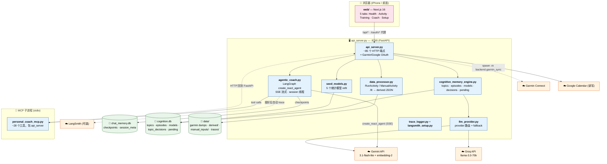

# PersonalCoach — 项目总览

[English](PROJECT_GUIDE.md) · **中文**

项目怎么搭的、还剩什么没做，以这份为准。**唯一**的 doc——取代之前散落的一整套
（architecture、coach_brain_design、coach_chat_design、mcp_tools_design、
IMPROVEMENTS、CI、langsmith-setup、PROMPT_CHANGELOG）——那些是某个时间点的
笔记，随着代码推进逐渐过期。本文反映**当前**状态（2026-05-28）。

> Prompt changelog 现在在 [§3.4.3](#343-prompt-版本管理)；LangSmith 接入在
> [§3.4.4](#344-可观测性--traces--langsmith)；Garmin token 设置（以前在
> README 里的 429 绕过流程）在 [§3.2](#32-authentication)。

---

## 目录

- [1. 概述](#1-概述) — 这个 app 是什么、大图
- [2. 前端](#2-前端) — Next.js web，5 个 tab
- [3. 后端](#3-后端)
  - [3.1 Data processor](#31-data-processor) — 数据层
  - [3.2 Authentication](#32-authentication) — Garmin + Google OAuth
  - [3.3 MCP tools](#33-mcp-tools) — agent 能调什么
  - [3.4 AI / Coach](#34-ai--coach)
    - [3.4.1 Coach brain](#341-coach-brain--记忆模型四个输入流) — 记忆、模型、4 个输入流 **（长）**
    - [3.4.2 Coach chat](#342-coach-chat--session-设计) — session 边界的聊天
    - [3.4.3 Prompt 版本管理](#343-prompt-版本管理)
    - [3.4.4 可观测性](#344-可观测性--traces--langsmith) — JSONL traces + LangSmith
- [4. 工程债](#4-工程债) — CI、测试、tracing、repo 重组、未决缺口 **（最长）**
- [5. 附录](#5-附录) — 存储一览、provider 路由、文档沿革

---

## 1. 概述

单用户、iPhone 优先的 AI 跑步教练。一个用户（owner）跟一个常驻教练 agent
对话，agent 推理的依据包括：Garmin 传感器数据、恢复指标、计划日历、主观
check-in，以及一份累积的长期记忆（过去的 topics、episodes，和描述用户身体
行为规律的统计模型）。

项目分两半：

- **前端** — `web/`，Next.js app，5 个 tab。
- **后端** — `backend/`，一个 FastAPI 进程 + 一个 MCP 子进程。可拆成：data
  processor、authentication、MCP tools，和 AI/coach 层（记忆 + 模型 +
  prompt + LangChain + LangSmith）。



**状态：** coach-brain 路线图 Phase 0 → Phase 3 全部完成。四个输入流全部
就绪；模型库里有 5 个统计模型；后端 711 个测试通过。路线图细节见
[§3.4.1](#341-coach-brain--记忆模型四个输入流)，剩余工作见 [§4](#4-工程债)。

---

## 2. 前端

`web/` — Next.js 16（注意：这是较新的 Next.js，跟老版本有 breaking changes；
改路由/server 约定前先读 `node_modules/next/dist/docs/`）。React Query 取数。
Tailwind。iPhone 优先布局。

**五个 tab：**

| Tab | 路由 | 内容 |
|---|---|---|
| Health | `/` | 今日 check-in 卡、context-events 卡、readiness、恢复/睡眠图表 |
| Activity | `/activity` | 跑步列表 + 单次详情（`/activity/[id]`）含地图/遥测/分段 + "Ask AI about this run" |
| Training | `/training` | 周期总览、月度图、计划日历、未来计划训练（可编辑） |
| Coach | `/coach` | session 制聊天线程（流式）、action pills、day dividers |
| Setup | `/setup` | Garmin / Google 登录、同步控制 |

**关键 client 模块（`web/lib/`）：**
- `api.ts` — `apiGet/Post/Put/Delete` + `streamSSE`（流式聊天的 SSE 帧解析）
- `hooks/use-coach-session.ts` — localStorage 存当前 `thread_id`
- `coach-errors.ts` — 把 provider 限流/代理超时分类成友好的中文提示 + 重试建议
- `todays-read.ts` — "Today's Read" 句子的按天缓存
- `format.ts` — 日期/配速/距离格式化
- `types.ts` — 所有 TypeScript 接口（对应后端响应结构）

**每张卡的硬规矩（踩了 3 次坑总结的）：** 每个 React Query `useMutation`
必须渲染 `isError`；每个 `useQuery` 必须把 `isError` 跟空状态分开；持有
mutation 的 modal 要有 `isMounted` 守卫。见 memory 里的
`feedback_no_silent_mutation_errors.md`。

---

## 3. 后端

`backend/` Python 包。FastAPI 进程（`api_server.py`）是唯一数据源——其它
需要数据的地方都通过 HTTP 调它，而不是直接 new 一个 `DataProcessor`（避免
两个实例在同一批 JSON 文件上打架）。

### 3.1 Data processor

**`data_processor.py`** — 纯数据层。无 LLM、无 HTTP；读 `data/*.fit` +
Garmin JSON dump + 手动输入，归一化成 typed 结构。

- `RunActivity` / `ManualActivity` dataclass — 对原始 Garmin/手动记录的
  typed 视图（配速、HR、步幅、爬升、地面类型）。
- `get_health_stats()` — 每日健康台账（sleep_hours, rhr, hrv, stress,
  run_miles）——喂 HRV/睡眠/里程模型。
- `compute_route_profile(activity_id)` — 从遥测算坡度分布 + 爬升/下降
  （P5）。
- CRUD：check-in、计划训练、训练周期块、手动活动、用户 HR 区间。
- **规矩：** 所有 shaping/聚合都在这里；dashboard/UI 只调函数 + 渲染。数据
  同时为 UI 和 AI 成形——数值 + 预格式化字段并列，单位自描述。

### 3.2 Authentication

两个外部 auth 流程；**app 永远不碰密码**——用户自己登录，app 只存拿到的
token。

- **Garmin** — `backend/garmin_ticket_login.py` 把手动拿到的 Service
  Ticket 兑换成长效 garth OAuth2 token（"429 绕过流程"，见下面的设置）。
  `backend/garmin_sync.py` 再用它拉活动 + 每日健康，通过
  `python -m backend.garmin_sync` 由 `POST /api/sync/garmin` 触发。
- **Google Calendar** — `google_calendar.py`。OAuth 在
  `/oauth/google/start` → `/callback`。Scope 是 `calendar.events`
  （读+写；我们把 AI 排的训练写进用户日历）。增量授权用
  `include_granted_scopes=true`。Token 在 `data/oauth/google_token.json`。
  - **坑（搭进去一整段 debug）：** 别同时列 `calendar.readonly` 和
    `calendar.events`——Google 会合并成只给 `events`，触发 `oauthlib`
    的严格 scope 检查 → callback 报错 → 静默"未连接"。只列
    `calendar.events`。

##### Garmin token 设置（429 绕过流程）

Garmin 现在全面启用了严格的 Cloudflare 防爬虫。用 Playwright 等自动化浏览器
登录极易触发 `HTTP 429 Too Many Requests` 和无限验证码死循环。绕过办法：在
浏览器**手动获取一次性 Service Ticket**，再用项目脚本**立刻**兑换成长效的
garth `OAuth2` 通行证。

> **绝不**把 Service Ticket、密码或 token 写进 git / 截图——都是短效 secret。

**步骤 1 — 手动拿 Service Ticket（`ST-…`）**（一次性，有效期不到 1 分钟，
拿到后**立刻**跑步骤 2）：
1. 开一个**全新无痕**浏览器窗口。F12 → **Network** 面板 → 勾选
   **Preserve log（保留日志）**。
2. 访问移动端 SSO 登录链接：
   ```
   https://sso.garmin.com/mobile/sso/en_US/sign-in?clientId=GCM_ANDROID_DARK&service=https://mobile.integration.garmin.com/gcm/android
   ```
3. 正常输入账号密码登录（有验证码就手动过）。成功后页面会跳转到"找不到
   网页"——**这是正常的**。
4. 复制地址栏**整段 URL**，或只复制 `ticket=ST-…-sso` 那部分。

**步骤 2 — 兑换并写入 garth**（在项目根目录）：
```bash
# A：直接把重定向 URL 或 ST 字符串作为参数（最快）
uv run python -m backend.garmin_ticket_login --url "https://...ticket=ST-..."
# 或
uv run python -m backend.garmin_ticket_login --ticket "ST-....-sso"

# B：无参数运行，按提示粘贴重定向后的完整 URL
uv run python -m backend.garmin_ticket_login

# C：先自动打开登录页，再粘贴地址栏 URL
uv run python -m backend.garmin_ticket_login --open-browser
```
脚本会把 ST 换成长效会话（`~/.local/share/pirate-garmin/native-oauth2.json`，
可用 `--app-dir` 覆盖），并把 DI token 写入 `~/.garth/oauth2_token.json`。

有用的参数：
- `--compat` — 同时生成 `oauth1_token.json` + `domain_profile.json` 占位，
  兼容仍检查 OAuth1 的旧版 `garminconnect`。
- `--run-sync` — 成功后自动跑 `python -m backend.garmin_sync`。

```bash
# 兑换 + 兼容占位 + 拉数据 一条龙
uv run python -m backend.garmin_ticket_login --url "$PASTED_URL" --compat --run-sync
```

**已经有 `native-oauth2.json`？** 只需迁移进 garth：
```bash
uv run python -m scripts.migrate_garmin_token
```
（`scripts/migrate_garmin_token.py` 跟 `backend/garmin_ticket_login.py`
共用同一套迁移逻辑。）

**恢复：** 别手改 `.venv` 硬编码票据——`uv sync` 会覆盖。若改过，用
`uv sync --reinstall-package pirate-garmin` 恢复上游行为。

### 3.3 MCP tools

**`personal_coach_mcp.py`** — MCP 服务（`@mcp.tool()` 装饰器），由
`agentic_coach._ensure_agent` 起成 stdio 子进程。每个工具都是对
`api_server` 的薄 HTTP 封装（保持单个 `DataProcessor`，避免竞争）。
~28 个工具，分组：

| 分组 | 工具 |
|---|---|
| Profile / readiness | `get_athlete_profile`、`get_readiness`、`get_training_load`、`get_recent_checkins` |
| 跑步 | `list_runs`、`get_run_detail`、`get_run_telemetry`、`get_run_weather`、`get_run_route_profile`、`get_plan_actual_deviation` |
| 训练周期 | `list_blocks`、`get_cycle_stats`、`get_monthly_stats` |
| 日历 / 计划 | `get_calendar_events`、`get_workout_plan`、`get_planned_workouts`、`propose_workout_plan` |
| 外部 context | `get_external_events` |
| 手动活动 | `list_manual_activities`、`get_manual_activity` |
| 记忆 (CME) | `recall_topics`、`search_episodes`、`get_pending_clarifications`、`get_model`、`list_models`、`propose_model_from_topic`、`list_pending_decisions`、`resolve_decision` |

**设计原则（出自 IMPROVEMENTS §2，现已落实）：** MCP 层做*投影*，不是
原样透传。Garmin 的解读性标签（`trainingEffectLabel`、`vO2MaxValue`…）在
这一层被过滤，而不是靠 prompt 规则。Agent 看到的是自描述的 key
（`medium_term_hr_effort_map`，而不是原始 `hr_zones`）。

### 3.4 AI / Coach

智能层。`agentic_coach.py` 拥有 agent（LangGraph 的
`create_react_agent`，工具调用固定用 Gemini 3.1-flash-lite，SSE 流式）。
`llm_provider.py` 是唯一允许调 LLM 的模块（provider 路由 + fallback 链：
gemini → groq → 本地）。

#### 3.4.1 Coach brain — 记忆、模型、四个输入流

*（这是长 section——coach-brain 路线图，Phase 1–3 的主要工作量。）*

##### 四个输入流（绝不合并）

教练信号来自流之间的**不一致**。即使词汇相同，也绝不假设两个流一致。

| 流 | 来源 | 是什么 |
|---|---|---|
| **objective（客观）** | Garmin 传感器（经 `data_processor`）+ 天气 + 路线/地形 | 原始测量：HR、配速、距离、漂移、坡度。Garmin 的解读性标签是噪声，在 MCP 层过滤掉。 |
| **perceived（感知）** | `daily_checkins.json`（睡眠/酸痛/情绪/动力 0-5）+ 每次跑的 `manual_meta` RPE 标签 + 中期 HR↔体感映射 | 用户*感觉到*/*报告*的。事后 RPE 不等于计划意图。 |
| **planned（计划）** | Google-Cal 同步的训练（`planned_workouts.json` + `cal_event_id`）+ 计划-实际偏差 | *本应*发生的。 |
| **external（外部）** | `travel` / `illness` / `life_stress` episodes（CME） | 传感器看不到的 context——某个数字为什么有意义、或者是已知的数据失真日。 |

##### 认知记忆引擎（CME）— `cognitive_memory_engine.py`

长期记忆，存在 `cognition.db`。六张表：

- **topics** — 状态机（Open / Testing / Resolved / Conflicting）+
  `working_conclusion` + `open_question` + `related_models`。
- **episodes** — 5W1H + `lesson_learned` + 事件时间戳。包含外部 context
  类型（`travel`/`illness`/`life_stress`、`daily_checkin`）。
- **models** — 关于用户的参数化观察（模式库；见下）。与 episodes 平行。
- **topic_episode_links** — junction（链接的权威来源）。
- **pending_clarifications** — agent 的问题队列。
- **topic_decisions** — LLM 提案的审计日志（new_model / merge / conflict）。

`consolidate_memory_background` 是那个 LLM 调用：session 关闭时，从已关闭
的聊天线程里抽出 `{new_topics, topic_updates, new_episodes, conflicts}`
并 upsert（用 embedding 跟现有 topic 匹配）。

##### 模型（模式）库

模型刻画用户身体的行为规律——这是教练之所以像教练而不是表格的原因。两条
推导路径：

- **stat-derived（统计推导）**（`seed_models.py`）——从原始数据算出来，
  通过 `POST /api/memory/models/refit/{key}` 按需 refit（registry 驱动；
  未来的 nightly cron 会遍历 `REFIT_REGISTRY`）。已上线 5 个：
  - `recovery.hrv_14d_baseline`（mean_std）— 滚动 14 天 HRV。
  - `aerobic.decoupling_baseline`（mean_std）— easy run 的 pace/HR 漂移。
    负值 = HR 稳定/下降；健康信号。
  - `cadence.baseline`（mean_std）— easy run 稳态步频。
  - `sleep.debt_14d`（mean_std）— 14 天睡眠 + 相对 8h 目标的总赤字 +
    低于目标的晚数。
  - `cycle.weekly_volume_diff`（linear_trend）— 6 个完整周的周里程斜率
    （当前周丢弃，避免半周造成的虚假下降）。
- **llm-derived（LLM 推导）**（P2 管道）——`propose_model_from_topic` 问
  LLM"这个 topic 能参数化泛化吗？"，park 一个 `kind='new_model'` 决策；
  用户在 chat 里确认（不单开 UI 页）；`resolve_decision` 创建模型 + 链回
  topic。

Agent 通过 `get_model` / `list_models` 读模型。实测（2026-05-28）确认
agent 会自主查这 5 个 baseline 并引用精确数字——不需要 prompt 提示。

##### 路线图状态（Phase 0–3，全部完成）

| Phase / PR | 内容 |
|---|---|
| Phase 0（felt-pain） | 多日时间线修复、tracing 脚手架、SSE 流式 |
| Phase 1 | 模型管道前的基建 |
| P1 | `models` 表脚手架 + CRUD + 种 HRV baseline |
| P2 | episode → model 的 LLM 提案管道（chat 里确认） |
| P3 | 每日 check-in 卡（perceived 流） |
| P4a | 计划训练 → 写 Google Cal 闭环（静音提醒） |
| P4b | 计划训练编辑 UI + 计划-实际偏差工具 |
| P5 | 外部 context（route-profile 工具 + travel/illness/life-stress） |
| P6 batch 1 | aerobic decoupling + cadence baseline |
| P6 batch 2 | sleep debt + weekly volume trend baseline |
| E（Phase 3） | LangSmith tracing 接入 + observability 端点 |

#### 3.4.2 Coach chat — session 设计

*（已实现。原本是 `coach_chat_design.md` 的设计；现在建好了。）*

一次对话对应运动员 ↔ 真人教练的交流。Session 是**话题边界**的：

1. **由用户——不是 AI——结束 session。** End & Save 触发 summarize +
   `consolidate_memory_background`。
2. **session 内 AI 看逐字历史。** 不做滚动摘要；一个聚焦的 5–15 轮 session
   足够小，"全部"就是对的 context 量。session 边界就是裁剪点。
3. **跨 session AI 看不到任何直接历史**——它按需通过工具检索内化后的形态
   （topics/episodes/models）。

已建表面：流式聊天（`/api/ai/chat/stream`，SSE）、5 个 action
（`review_workout`、`review_health`、`make_plan`、`follow_up_memory`、
`summarize_and_archive`——注意 `follow_up_memory` 的 UI 标签是 "Memory"、
配大脑图标）、session 列表 + 删除、线程里的多日 DayDivider、每条消息
时间戳。Pre-fetch plan 用并行 MCP 调用 hydrate action 轮次，作为 system
context 注入。

#### 3.4.3 Prompt 版本管理

`agentic_coach.py` 里的 `PROMPT_VERSION` 常量（当前 **v8**）。system
prompt 每轮由 `_build_prompt(state)` 构建——它在静态人设前面前置今天的日期
（tz-aware，认 `PERSONAL_COACH_TZ`），这样 agent 不会把训练排到过去。
trace 的 `prompt_hash` 算的是
`f"{_HEADER_TEMPLATE.format(sentinel_date)}\n\n{_SYSTEM_PROMPT}"`——每日
变的日期不会扰动 hash，但任何 wrapper 或人设的改动会。版本 + hash 落进
每条 trace 行，所以"哪个 prompt 产生了这轮"不用猜。

**约定——怎么升版本：** 任何对 LLM 可见 system 文本的改动（`_SYSTEM_PROMPT`
或 `_HEADER_TEMPLATE` wrapper）必须在**同一个 commit** 里：(1) 升
`PROMPT_VERSION`，(2) 在下面的 changelog 加一行。Reviewer 会拒绝没升版本
的 prompt 改动——否则 trace 会把旧版本号盖在一个其实不同的 prompt 上。

**按版本读 trace：**
```bash
# 今天所有 v8 的轮次
jq -c 'select(.prompt_version == "v8")' data/traces/$(date +%F).jsonl
# 漂移检查——版本号 vs 实际内容 hash
jq -c 'select(.prompt_version == "v8" and .prompt_hash != "<current>")' \
  data/traces/$(date +%F).jsonl
```
权威 hash 在 AgenticCoach init 时打日志（grep startup 输出）。

##### Prompt changelog

| 版本 | 日期 | 改了什么 | PR |
|---|---|---|---|
| **v8** | 2026-05-27 | 在 `_SYSTEM_PROMPT` 前加每轮渲染的日期 header（`_HEADER_TEMPLATE`）。前置 "Today is YYYY-MM-DD (Weekday)" + 中英文相对时间指令（`今天 / 明天 / 后天 / 这周`）+ "绝不把训练排到过去"。今天用 `datetime.now(_user_tz()).date()`（认 `PERSONAL_COACH_TZ`，否则进程本地 tz）。hash 改为覆盖 wrapper + 人设（用 sentinel date）。修了一个真 bug：agent 把"今天 easy run"排到了 2026-05-14，因为它没有日期锚点。 | [#84](https://github.com/zhnzhang61/PersonalCoach/pull/84) |
| v7 | 2026-05-13 | Codex P2：明确列出哪些 Garmin 单跑解读性标签在 MCP 边界被过滤（`aerobicTrainingEffect`、`anaerobicTrainingEffect`、`activityTrainingLoad`、`trainingEffectLabel`、`aerobicTrainingEffectMessage`），以及哪些长期 baseline 不过滤（`vo2max_running`、`lactate_threshold_hr`、`lactate_threshold_pace`）。取代 v6 含糊的"你看不到它们"。 | [#68](https://github.com/zhnzhang61/PersonalCoach/pull/68) |
| v6 | 2026-05-13 | 删掉 "SILENTLY IGNORE…" 块 + 禁用字段清单——这些字段现在在 MCP 数据层过滤（见 §4.2），prompt 规则不再 load-bearing。prompt 里 `hr_zones` → `medium_term_hr_effort_map` 对齐投影后的 key。 | [#68](https://github.com/zhnzhang61/PersonalCoach/pull/68) |
| ≤ v5 | 2026-05-13 之前 | 结构化 tracing 之前的历史。约 6 次迭代（session 制 Coach、换 Gemini 3.1 Flash Lite、archive divider）但没记精确 diff。trace 行 `prompt_version ≤ v5` 时，以内容 hash 为准。 | — |

#### 3.4.4 可观测性 — traces + LangSmith

两层：

- **本地 JSONL**（`trace_logger.py`）— 每轮一行写到
  `data/traces/YYYY-MM-DD.jsonl`：turn_id、prompt_version、prompt_hash、
  user_input、final_answer、duration_ms、error。权威审计日志，不离开本机。
  tracing 永不向调用方抛异常。**抓不到 per-tool 调用和 token 数**——这是
  LangSmith 补的缺口。
- **LangSmith**（`langsmith_setup.py`，可选）— 设了 env var 后，langchain
  自动 instrument 完整的 tool-call + LLM 树（per-tool 输入输出、token 数、
  延迟、跨 prompt 版本 diff）。`GET /api/admin/observability` 报告状态
  （永不回显 key）。

##### LangSmith 接入

可选。免费层 5,000 traces/月——单用户开发大概 50–200/天，远没到顶。

1. **注册** <https://smith.langchain.com> → Settings → API Keys →
   Create。Key 以 `lsv2_` / `ls__` 开头，当 secret 对待。
2. **设 env vars**（shell rc 或 `.envrc`）：
   ```bash
   export LANGSMITH_TRACING=true              # 必须是小写 "true"
   export LANGSMITH_API_KEY=lsv2_pt_...        # 上一步拿的
   export LANGSMITH_PROJECT=personalcoach      # 可选，归类 traces
   ```
   - **`LANGSMITH_TRACING` 必须是字面的小写 `"true"`。** langsmith 做严格
     `var_result == "true"` 检查；`1` / `yes` / `on` / `True` 全部被拒。
     startup 日志行会显式标出这种配错。
   - **老的 `LANGCHAIN_*` 名也认**（`LANGCHAIN_TRACING_V2` /
     `LANGCHAIN_API_KEY` / `LANGCHAIN_PROJECT`）——langsmith 两个命名空间
     都读。状态里的 `*_source` 字段告诉你实际读到的是哪个。
3. **重启后端。** 一行 startup 日志告诉你状态：
   ```
   LangSmith tracing: ON (project=personalcoach, source=LANGSMITH_TRACING, endpoint=https://api.smith.langchain.com)
   ```
   四种状态：

   | startup 行 | 含义 |
   |---|---|
   | `OFF (no LANGSMITH_TRACING / LANGCHAIN_TRACING set)` | env var 没进进程（忘了重启 shell） |
   | `MISCONFIGURED — flag is 'X' but langsmith requires lowercase 'true'` | 打错了（`=1`、`=True`）——改成小写 `true` |
   | `MISCONFIGURED — tracing flag is set but no API key found` | flag 对，两个命名空间都没 key——span 静默 401 |
   | `ON (...)` | 在流 |

4. **验证：**
   ```bash
   curl -s http://localhost:8765/api/admin/observability | python3 -m json.tool
   # → {tracing_enabled: true, tracing_flag_source: "LANGSMITH_TRACING",
   #    api_key_set: true, project: "personalcoach", ...}
   ```
   `api_key_set: true` 确认找到 key（值永不回显）。然后去 `/coach` 发条
   消息，刷新 LangSmith 项目——完整 run（prompt → tool calls → answer）
   ~10 秒内出现。

5. **关掉：** `unset LANGSMITH_TRACING`（或 `=false`）+ 重启。JSONL 照常
   工作，只是少了 hosted UI。

**隐私：** LangSmith 把 prompt + completion 存在他们的基础设施上——涉及
敏感数据前先看他们的数据政策。API key 只在 env（不进任何被追踪的文件）。
`/api/admin/observability` 端点返回 project + endpoint，但永不返回 key。

---

## 4. 工程债

*（最长的 section——工程质量 backlog。跟 §3.4.1 的 coach-brain 功能路线图
是两回事：那个是"造教练智能"，这个是"保持代码库健康"。两者交叉引用，但分开
追踪。）*

### 4.1 CI + 测试覆盖 — ✅ 基本完成

GitHub Actions `ci.yml` 跑 Python（`uv run pytest`）+ web
（`tsc --noEmit`、`eslint`）。本地复现：

```bash
uv run pytest -q            # 后端，repo root
cd web && npx tsc --noEmit && npx eslint .   # 前端
```

截至 2026-05-28 覆盖：**711 个测试通过，3 个 skip。** 按模块：

| 模块 | 测试 | 备注 |
|---|---|---|
| `data_processor.py` | 112 | RunActivity、健康台账、route profile、CRUD |
| `personal_coach_mcp.py` | 48+ | 所有工具（path + params + shape，mock `_get`） |
| `cognitive_memory_engine.py` | 41+ | topics/episodes/models/links、迁移 |
| `api_server.py` | smoke（≈65 路由 no-500）+ behavior | dispatch、mutations、memory CRUD |
| `google_calendar.py` | 35 | OAuth 流程 + 事件映射（mock googleapiclient） |
| `seed_models.py` | 60+ | 5 个模型 refit + helper，所有算式都 pin 死 |
| `agentic_coach.py` | basics + `_build_prompt` | session 守卫、今日日期注入 |
| `langsmith_setup.py` | 41 | env-var 组合 + 不泄 key 的 invariant |
| 前端 | TS + ESLint gate | 还没有 Vitest 单测（单用户规模够用） |

**剩余（原 CI 计划的 Phase 3/4）：** 前端纯函数的 Vitest 单测
（`format`、`coach-errors`、`todays-read`、`use-coach-session`）；用真
Gemini key 的集成测试，放在 `--integration` flag 后面。都不阻塞。

### 4.2 数据层过滤（不是 prompt 规则）— ✅ 完成

Garmin 解读性标签在 MCP 边界过滤，不靠 "SILENTLY IGNORE..." 的 prompt
块。Prompt 是不稳定接口（换模型/换语言/长 context 会丢规则——已经烧过两
次）；数据层才是过滤噪声的稳定地方。`hr_zones` → `medium_term_hr_effort_map`
投影，让 prompt 和工具输出用同一个显式名字。省掉 review_workout 首轮约
30% 的 prompt 预算。

### 4.3 结构化 tracing — ✅ 完成

两半都上线了：本地 JSONL（PR B）+ LangSmith（PR E）。见
[§3.4.4](#344-可观测性--traces--langsmith)。原始需求里的"每轮快照 prompt
版本"（已通过 `PROMPT_VERSION` + `prompt_hash` 实现）和"穿过
consolidate_memory_background 的轨迹"（CME 提案管道现在记 `topic_decisions`
行）都做了。

### 4.4 Repo 布局重组 — ⚠️ 部分完成

后端现在是 `backend/` 包（曾经是顶层一摊散文件）；`scripts/` 放一次性 CLI
+ `migrations/`。进一步按角色分组（如 `backend/ai/`、`backend/data/`
子包）在 2026-05-13 规划过但没执行，当前规模下不急。
**待定：** 留作 backlog 项还是删掉。

### 4.5 未决缺口（功能开发期间新发现的）

- **`POST /api/memory/models/refit-all`** — 遍历 `REFIT_REGISTRY`，一次
  refit 所有模型；接到 startup。P6 测试时发现：新建/重建的 `cognition.db`
  会让模型库为空，直到手动逐个 refit（2026-05-28 HRV baseline 就是空的，
  手动打端点才回来）。约半天。
- **`tempo.pace_hr_table`** — P6 batch 2 延迟的那个，因为用户的
  `lap_categories` 太稀疏（~0 个 tempo 标签）。改用 HR-band 启发式（laps
  里 avg_hr 落在 LT × [0.88, 1.02]、时长 ≥ 3 分钟）就不需要用户标签了。
  约半天。
- **非跑步活动可见性**（Activity tab 上的游泳/骑行）— UI bug，不是 AI。
  `/api/runs` 过滤 `"running" in typeKey`，所以同步进来的游泳/骑行从它和
  `/api/manual-activities` 两边都漏掉。

（*同步 gap 韧性 + stub 检测已在 #77 上线——`garmin_sync.py` 里的
`_is_stub` + `days_back` 从 5 调到 30——所以不再是缺口。*）

### 4.6 substrate 之后的功能（排在 Phase 3 之后）

- **§6 advice trail** — 教练说了什么、用户接受没、结果如何。约 2–3 天。
- **§8 goal feasibility** — 从周期内已完成的训练做预测 + 计划调整。
  约 2–3 天。

---

## 5. 附录

### 存储一览

```
data/
├── chat_memory.db        # LangGraph checkpoints + session_meta
├── cognition.db          # CME: topics · episodes · models ·
│                         #      topic_episode_links · topic_decisions ·
│                         #      pending_clarifications
├── get_activities/       # Garmin 原始 JSON dump
├── get_activity_details/ # 单次活动详情（遥测来源）
├── derived/              # 处理后的 CSV，含 daily_health_metrics.csv
├── manual_inputs/        # daily_checkins.json · planned_workouts.json ·
│                         # user_zones.json · run_*_meta.json
├── oauth/                # google_token.json、garmin tokens
├── traces/               # YYYY-MM-DD.jsonl agent traces
└── sync_state.json       # garmin_sync 游标
```

### Provider 路由

| 调用点 | 链 | 为什么 |
|---|---|---|
| Agent ReAct | gemini 3.1-flash-lite（固定） | 工具调用、大 context |
| summarize / consolidate / episodic summary | groq → gemini | 不占 agent 的 gemini RPM 预算 |
| embeddings | gemini embedding-2（固定，无 fallback） | 不同模型的向量在不同空间 |

限流感知的重试在前端（`coach-errors.ts`）：Gemini 429 → 10 秒冷却 + 自动
重试一次。

### 文档沿革 — 为什么以前有 8 个 doc

本指南取代了 8 个攒出来并逐渐过期的旧 doc：

| 旧 doc | 并入 | 为什么过期 |
|---|---|---|
| `architecture.md` | §1、§5 | 写着"17 个工具""流式延后""planned 流没接"——全都建好了 |
| `coach_brain_design.md` | §3.4.1 | 活的路线图——当前但啰嗦 |
| `coach_chat_design.md` | §3.4.2 | 状态头还写"尚未实现"，其实建好了 |
| `mcp_tools_design.md` | §3.3 | 5/9 的 v2 设计，比新增的 ~11 个工具早 |
| `IMPROVEMENTS.md` | §4 | 基建 backlog；item 1–3 完成，item 4 过期 |
| `CI.md` | §4.1 | 参考卡，吸收了 |
| `langsmith-setup.md` | §3.4.4 | 静态接入手册，不是追加式 |
| `PROMPT_CHANGELOG.md` | §3.4.3 | 版本表折进来了；per-commit "加一行" 约定现在指向 §3.4.3 |

没有单独保留的文件——这就是唯一的 doc。升 `PROMPT_VERSION` 时，把那行加到
[§3.4.3](#343-prompt-版本管理)。
