# PersonalCoach — Architecture Overview

Snapshot as of 2026-05-11 (just after Phase 2 PR-2 merge).

This is a single-user running-coach app. One human (the user) interacts
with one always-on coach agent that reasons over their Garmin sensor
data, recovery metrics, planned calendar, and an accumulated long-term
memory of past topics + episodes.

---

## Big picture

```mermaid
graph TB
    classDef ext fill:#fff3e0,stroke:#e65100,color:#000
    classDef db fill:#e8f5e9,stroke:#1b5e20,color:#000
    classDef proc fill:#e3f2fd,stroke:#0d47a1,color:#000
    classDef frontend fill:#fce4ec,stroke:#880e4f,color:#000

    %% --- Frontend ---
    subgraph Browser["📱 Browser (iPhone / desktop)"]
        WebApp["<b>web/</b> — Next.js 16<br/>5 tabs: Health · Activity ·<br/>Training · Coach · Setup"]:::frontend
    end

    %% --- Main backend process ---
    subgraph APIProc["🖥️ api_server.py — :8765 (FastAPI)"]
        API["<b>api_server.py</b><br/>~70 HTTP endpoints<br/>+ Garmin/Google OAuth"]:::proc
        AC["<b>agentic_coach.py</b><br/>LangGraph create_react_agent<br/>session-bounded chat threads"]:::proc
        CME["<b>cognitive_memory_engine.py</b><br/>topics · episodes · pending<br/>+ embedding match"]:::proc
        DP["<b>data_processor.py</b><br/>RunActivity / ManualActivity<br/>.fit → derived JSON"]:::proc
        LP["<b>llm_provider.py</b><br/>provider routing +<br/>fallback chains"]:::proc
    end

    %% --- MCP subprocess ---
    subgraph MCPProc["🔧 MCP subprocess (stdio)"]
        MCP["<b>personal_coach_mcp.py</b><br/>17 read-only tools<br/>wraps api_server endpoints"]:::proc
    end

    %% --- External services ---
    Gemini["☁️ Gemini API<br/>3.1-flash-lite (chat/agent)<br/>embedding-2 (vectors)"]:::ext
    Groq["☁️ Groq API<br/>llama-3.3-70b-versatile<br/>(precise/structured roles)"]:::ext
    Garmin["☁️ Garmin Connect"]:::ext
    GCal["☁️ Google Calendar"]:::ext

    %% --- Storage ---
    ChatDB[("📂 chat_memory.db<br/>checkpoints · writes ·<br/>session_meta")]:::db
    CMEDB[("📂 cognition.db<br/>topics · episodes ·<br/>topic_episode_links ·<br/>pending_clarifications")]:::db
    FS[("📂 data/<br/>get_activities/ · *.fit ·<br/>derived/ · manual_inputs/")]:::db

    %% --- CLI / background ---
    subgraph CLI["⚙️ scripts/ — CLI + one-off tools"]
        MCPSmoke["<b>manual_mcp_smoke.py</b><br/>dev: stdio dump each MCP tool"]:::proc
        MigrateGarmin["<b>migrate_garmin_token.py</b><br/>pirate-garmin → garth tokens"]:::proc
        MigV2["<b>migrations/v2_cme_schema.py</b><br/>add Conflicting status"]:::proc
        MigV3["<b>migrations/v3_dedupe_topics.py</b><br/>cosine-merge duplicate topics"]:::proc
        MigV4["<b>migrations/v4_link_episodes.py</b><br/>backfill topic_episode_links"]:::proc
    end

    %% --- Edges ---
    WebApp -- "/api/* proxy<br/>/oauth/* proxy" --> API
    API --> AC
    API --> CME
    API --> DP
    AC -- "create_react_agent" --> Gemini
    AC -- "tool calls" --> MCP
    AC -- "LangGraph checkpoints" --> ChatDB
    AC -- "summarize · consolidate" --> LP
    LP -- "agent / chat / actions" --> Gemini
    LP -- "summary · CME extract" --> Groq
    LP -- "embed topic signatures" --> Gemini
    CME -- "topics / episodes" --> CMEDB
    CME --> LP
    DP --> FS
    MCP -. "HTTP back to FastAPI<br/>(no in-proc shortcut —<br/>one DataProcessor instance)" .-> API
    %% Subprocess spawns: api_server runs garmin_sync + garmin_ticket_login
    %% via `python -m backend.<module>` (POST /api/sync/garmin endpoints).
    %% Those modules are in `backend/` now, not standalone CLIs.
    API -. "spawn -m backend.garmin_sync" .-> Garmin
    API --> GCal
    %% CME migrations write to cognition.db.
    MigV2 --> CMEDB
    MigV3 --> CMEDB
    MigV4 --> CMEDB
```



---

## What each script does

### Web (`web/`)
| Path | Purpose |
|------|---------|
| `web/app/health/` | Health tab — sleep / HRV / RHR snapshot + Today's Read card |
| `web/app/activity/` | Activity list + per-run detail page (`[id]/page.tsx`) with map / telemetry / laps + **"Ask AI about this run"** button |
| `web/app/training/` | Training tab — cycle, weekly monthly stats, calendar |
| `web/app/coach/` | **Coach tab** — session-based chat thread (added in PR-2) |
| `web/app/setup/` | Garmin / Google sign-in, sync controls |
| `web/components/coach/` | `CoachThread`, `MessageBubble`, `SessionDivider`, `ActionPills`, `ChatInput` |
| `web/components/health/readiness-card.tsx` | "Today's Read" — taps to run `review_health` |
| `web/components/activity/ask-ai-button.tsx` | Triggers `review_workout` from a run page |
| `web/lib/api.ts` | Tiny `apiGet/Post/Put/Delete` wrappers |
| `web/lib/hooks/use-coach-session.ts` | localStorage-backed current `thread_id` |
| `web/lib/coach-errors.ts` | Classify provider rate-limit / proxy timeouts → friendly Chinese messages |
| `web/lib/todays-read.ts` | Per-day cache for Today's Read sentence |

### Backend (`backend/` package)
| Module | Purpose |
|--------|---------|
| **`backend/api_server.py`** | FastAPI HTTP layer. ~70 endpoints — runs, manual activities, health, training blocks, calendar, AI (chat / 5 actions / sessions / history), CME (topics / episodes / pending), Garmin/Google OAuth. The single source of truth: anything else that needs data calls HTTP here, not `DataProcessor` directly. |
| **`backend/agentic_coach.py`** | The agent. Owns: `AgenticCoach` class wrapping LangGraph's `create_react_agent`; chat_memory.db (SQLite checkpointer); session lifecycle (`chat`, 5 actions, `summarize_and_archive`, `list_sessions`, `delete_session`); pre-fetch plans that hydrate review_workout / make_plan / etc with parallel MCP calls; the `_SYSTEM_PROMPT` and action-specific instruction fragments. |
| **`backend/cognitive_memory_engine.py`** | Long-term memory store. Topics state machine (Open / Testing / Resolved / Conflicting), episodes (5W1H+E), pending_clarifications, topic_episode_links. Embedding-based topic match (cosine + signature hash, cache keyed on `(provider, topic_id)`). Owns `consolidate_memory_background` — the LLM call that extracts {new_topics, topic_updates, new_episodes, conflicts} from a closed chat thread. |
| **`backend/data_processor.py`** | Pure data layer. `RunActivity`, `ManualActivity`, `DataProcessor` classes. Reads `data/*.fit` + derived JSON, normalizes pace/HR/stride/elevation/weather, owns the surface bucket / category labels. Only `api_server.py` is allowed to construct a `DataProcessor` (per [feedback_no_data_processing_in_dashboard.md](#)). |
| **`backend/llm_provider.py`** | The ONLY module allowed to call LLMs. Three public functions: `call_llm(messages, role, provider?, fallback_chain?)`, `call_embedding(texts, provider)`, `cosine_similarity`. Provider table: gemini (3.1-flash-lite) → groq (llama 3.3 70B) → omlx (local Qwen, last-resort). Embeddings pinned to gemini (embedding-2, multimodal-ready). |
| **`backend/personal_coach_mcp.py`** | MCP server (`@mcp.tool()` decorators). Spawned as a stdio subprocess by `agentic_coach._ensure_agent`. 17 tools: `get_athlete_profile`, `get_readiness`, `get_training_load`, `list_runs`, `get_run_detail`, `get_run_telemetry`, `get_run_weather`, `list_blocks`, `get_cycle_stats`, `get_monthly_stats`, `list_manual_activities`, `get_manual_activity`, `get_calendar_events`, `get_workout_plan`, `recall_topics`, `search_episodes`, `get_pending_clarifications`. Every tool is a thin HTTP wrapper around api_server — keeps one DataProcessor instance, avoids two-process races. |
| **`backend/garmin_sync.py`** | Pull activities + daily health from Garmin Connect. Writes to `data/get_activities/`, `data/get_activity_details/`, `data/derived/`, etc. Refresh-token flow uses `backend/garmin_ticket_login.py`. Spawned via `python -m backend.garmin_sync` by `POST /api/sync/garmin`. |
| **`backend/garmin_ticket_login.py`** | OAuth1 ticket-and-jar dance — Garmin's auth is older than OIDC, this writes `oauth1_token.json` + `domain_profile.json`. |
| **`backend/google_calendar.py`** | Google OAuth + event listing for the Training tab calendar. |

### CLI / one-off scripts (`scripts/` package)
| Module | Purpose |
|--------|---------|
| `scripts/manual_mcp_smoke.py` | Manual smoke script for the MCP server — spawns the stdio subprocess and dumps each tool's reply for a human to eyeball. Dev tool, not a pytest target. |
| `scripts/migrate_garmin_token.py` | One-off CLI to migrate a pirate-garmin `native-oauth2.json` into the garth-format tokens that `backend.garmin_sync` reads. Run once when onboarding. |
| `scripts/migrations/v2_cme_schema.py` | Add `open_question` / `conflict_context` to CME topics + allow `'Conflicting'` status. Idempotent. |
| `scripts/migrations/v3_dedupe_topics.py` | Cosine-merge duplicate topic rows via embeddings. Run after v2. |
| `scripts/migrations/v4_link_episodes.py` | Interactive backfill of `topic_episode_links` for orphan episodes. |

---

## Key data flows

### 1. User asks coach a question (free chat)
```
phone → web/components/coach/coach-thread.tsx (sendChat)
      → POST /api/ai/chat {thread_id, message}
      → api_server.ai_chat
      → agent.chat
      → AgenticCoach._run_turn
      → LangGraph create_react_agent (Gemini 3.1 Flash Lite)
        ↻ may call MCP tools:
          MCP subprocess → HTTP back to api_server (recall_topics etc.)
      → AIMessage stored in chat_memory.db via AsyncSqliteSaver
      → answer JSON back to web
```

### 2. User clicks "Ask AI about this run" on activity detail
```
phone → web/components/activity/ask-ai-button.tsx
      → POST /api/ai/action/review_workout
        {thread_id, activity_id, message: "请分析我 2026年5月10日 X 这次训练。"}
      → api_server.ai_action
      → agent.review_workout
        ↻ pre-fetch in parallel via MCP:
          get_athlete_profile, get_run_detail, get_run_telemetry,
          get_readiness, get_pending_clarifications
      → inject pre-fetched JSON as system context
      → LangGraph agent runs review_workout instruction set
      → answer back, web navigates to /coach
```

### 3. User taps "Today's Read" card on Health
```
phone → web/components/health/readiness-card.tsx (onTap)
      → POST /api/ai/action/review_health (fire-and-forget)
      → router.push("/coach")
      ... promise resolves later, .then writes
          first sentence to localStorage (todays-read.ts)
      → next visit to /health: card reads cache, shows AI sentence
```

### 4. User clicks End & Save
```
phone → POST /api/ai/action/summarize_and_archive {thread_id}
      → agent.summarize_and_archive
        ↳ summarize_thread → call_llm (Groq, role=precise)
        ↳ memory_engine.consolidate_memory_background
          → _llm_invoke (Groq, role=structured) extracts
            {new_topics, topic_updates, new_episodes, conflicts}
          → embedding-match each proposal (Gemini embedding-2)
          → upsert topics + episodes + pending_clarifications
            into cognition.db
        ↳ write session_meta {closed_at, summary, topics_added,
                              episodes_added} into chat_memory.db
```

### 5. Garmin sync (CLI / Setup tab button)
```
phone → POST /api/sync/garmin
      → api_server invokes garmin_sync.py
      → Garmin Connect API → activities + daily health
      → write data/get_activities/*.json, data/get_activity_details/*.fit,
        data/derived/*.json, data/derived/daily_health_metrics.csv
```

---

## Three streams of data (never collapse)

Per [feedback_perceived_vs_intent.md] — the prompts encode this rule:

| Stream | Source | What it is |
|--------|--------|-----------|
| **objective** | Garmin sensors via `data_processor` | HR, pace, distance, drift. Raw measurements only — Garmin's interpretive labels (`trainingEffectLabel`, `vO2MaxValue`, …) are explicitly noise. |
| **perceived (medium-term)** | `athlete_profile.fitness.hr_zones[].rpe_label` | User's current HR ↔ effort mapping baseline. Stable on the order of months. |
| **perceived (short-term)** | `manual_meta.category_stats` / `lap_categories` / `notes` | What the user labeled THIS run after running it. |
| **planned** | Google Calendar (Phase 2) | Workout intent. Currently null on every run. |

The coaching signal is the **mismatch** between streams — never assume `manual_meta.category` equals an HR-zone `rpe_label` even when the strings match. The prompts spell this out in a "Vocabulary Trap" section.

---

## Storage tour

```
data/
├── chat_memory.db          # SQLite — LangGraph checkpoints + session_meta
│   ├─ checkpoints          # per-thread message state (BLOB)
│   ├─ writes               # checkpoint writes
│   └─ session_meta         # {thread_id, closed_at, summary, topics/episodes added}
│
├── cognition.db            # SQLite — CME long-term memory
│   ├─ topics               # state machine + working_conclusion + open_question
│   ├─ episodes             # 5W1H + lesson_learned + event_timestamp
│   ├─ topic_episode_links  # junction
│   ├─ pending_clarifications
│   └─ topic_decisions      # audit log of LLM proposals
│
├── get_activities/         # Garmin raw JSON dumps
├── get_activity_details/   # Per-activity detail JSON
├── *.fit                   # FIT sport files (raw sensor)
├── derived/                # Processed time-series CSVs
├── manual_inputs/          # user_zones.json, manual notes
└── sync_state.json         # Cursor for the next garmin_sync run
```

---

## Provider routing today

| Call site | Provider chain | Why |
|-----------|--------------|-----|
| Agent ReAct (`agentic_coach._run_turn`) | gemini 3.1-flash-lite (pinned) | Tool-calling, large context (250k TPM headroom for review_workout's ~14k first-turn prompt) |
| `summarize_thread` | groq → gemini | Short single-turn; off the agent's gemini RPM budget |
| `consolidate_memory_background` | groq → gemini | Long-context JSON extraction; off the gemini RPM budget |
| `generate_episodic_summary` | groq → gemini | Run import path; off the gemini RPM budget |
| All `call_embedding` | gemini embedding-2 (pinned, no fallback) | Vectors from different models live in different spaces; embedding swap = invalidate all cached vectors |

Rate-limit-aware retry lives in the frontend (`coach-errors.ts`) — Gemini 429s → 10s cooldown + auto-retry once.

---

## Things deliberately not yet done

- **Streaming responses (SSE)** — current UX is spinner + full-answer. Deferred per the Coach design doc.
- **"Load earlier sessions"** in /coach — currently fixed 3 most-recent. Add pagination once session count > 10.
- **Persist embeddings to SQLite** — today they're an in-memory cache keyed on `(provider, topic_id)`. At 11 topics / 58 episodes cold start is negligible; revisit at ~300 topics.
- **Phase 2 PR-3: planned-stream wiring** — `calendar_events` are read by `get_calendar_events` tool but not yet treated as `planned` workout intent in review_workout. Three streams are still effectively two (objective + perceived).
